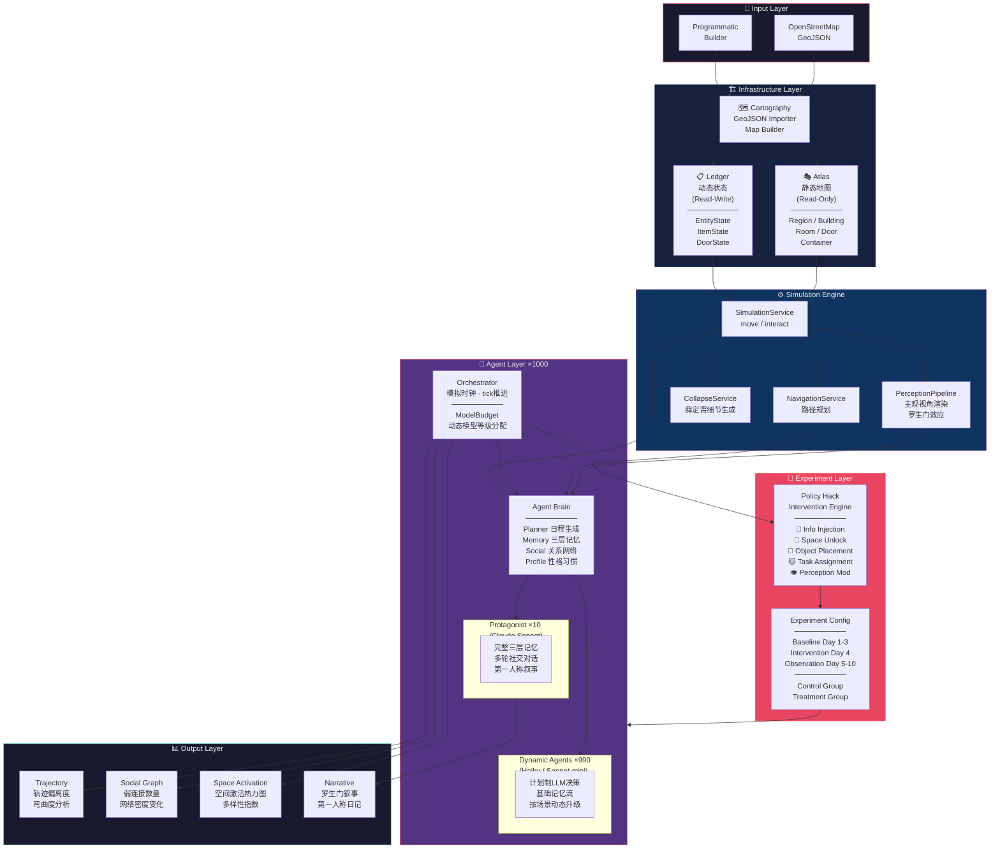

# Synthetic Socio Wind Tunnel — System Architecture

## Legend

| Layer | Role |
|-------|------|
| **Atlas** | Frozen stage set — walls, doors, rooms (never mutates) |
| **Ledger** | Live prop table — positions, items, states |
| **SimulationService** | The only writer to Ledger |
| **PerceptionPipeline** | Subjective rendering — same scene, different views |
| **Policy Hack** | Experimental variable — injects stimuli into the simulation |
| **ModelBudget** | Dynamic LLM grade allocation — 1000 agents, ~$3-5/simulated day |
