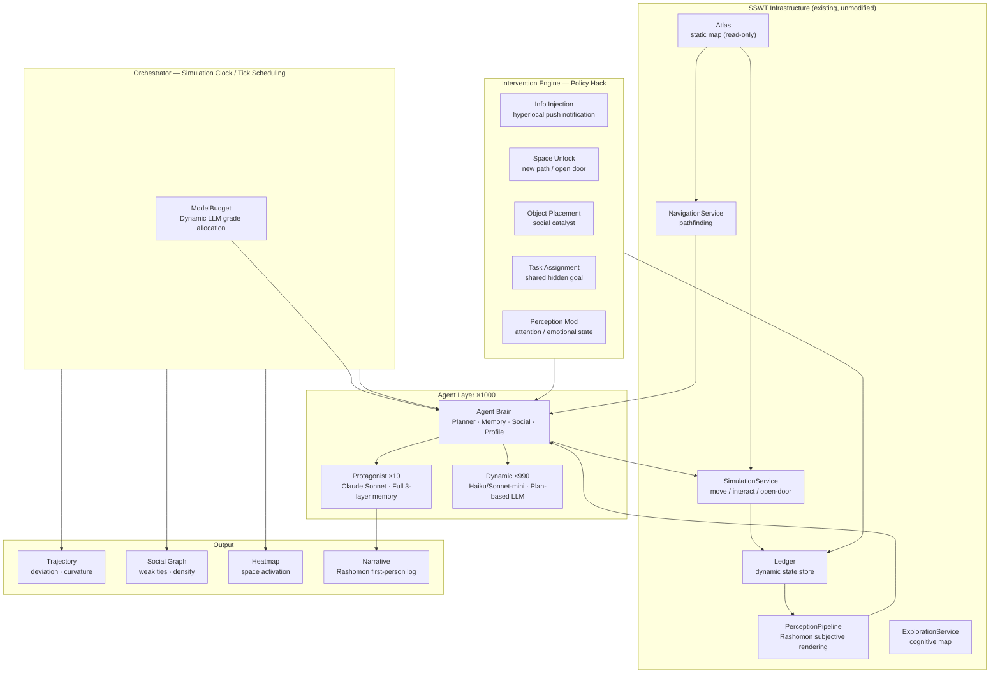

# Project Proposal
## Synthetic Socio Wind Tunnel: A Policy Hack Engine for Hyperlocal Boundary Infiltration

**Submitted in response to:**
*Border Crossings: Instruments of Erasure and Infiltration*

**Submitted by:** [Your Name]
**Date:** March 2026
**Requested Budget:** AUD $80,000

---

## 01 — Context: The Problem We Are Designing For

### Hyperlocality

The social scale most thoroughly destroyed by contemporary urban life has a name: **hyperlocality** — the human-centred radius of under one kilometre where real neighbours live, nearby space unfolds, and everyday encounters happen. It is the smallest meaningful unit of community existence. And it is precisely the scale that algorithms ignore, attention skips over, and design habitually overlooks.

In new residential developments, people live in apartments separated by only centimetres of concrete. They share corridors, lifts, train platforms, and supermarket queues. Yet on community forums, the same posts appear again and again: *"How do I meet my neighbours?"* / *"Why do I feel lonelier in an apartment block than I would in the middle of nowhere?"* / *"Does anyone know who lives next door?"*

This is not a housing problem. In any conventional sense, it is not a failure of urban planning either. It is a **hyperlocal erasure** — the systematic destruction of the social ecology within a half-kilometre radius, caused by no single deliberate actor, but by four invisible walls working in concert.

*The specific site for this project has not yet been finalised. Phase 1 will select a neighbourhood of moderate density, with clear boundaries and accessible community organisation. Site selection criteria and process are detailed in Section 03.*

### The Four Invisible Walls

We define the boundary not as a physical structure but as a layered, systemic condition that operates below conscious awareness:

```
┌──────────────────────────────────────────────────────────────────┐
│                     Four Invisible Boundaries                     │
├──────────────────┬───────────────────────────────────────────────┤
│  Layer 1          │  The Digital Attention Wall                   │
│  Mechanism →      │  Screens capture gaze; global news consumes  │
│                   │  cognitive bandwidth                          │
│  Consequence →    │  The physical environment within 1km becomes  │
│                   │  functionally invisible                        │
├──────────────────┼───────────────────────────────────────────────┤
│  Layer 2          │  The Algorithmic Information Wall             │
│  Mechanism →      │  Recommendation engines suppress hyperlocal   │
│                   │  content (global events generate more clicks) │
│  Consequence →    │  Hyperlocal stories are systematically        │
│                   │  filtered before they reach residents          │
├──────────────────┼───────────────────────────────────────────────┤
│  Layer 3          │  The Spatial Habit Wall                       │
│  Mechanism →      │  Optimised commute routes; urban design        │
│                   │  prioritises throughput over dwelling          │
│  Consequence →    │  Public space becomes a commute corridor;      │
│                   │  serendipitous encounter becomes impossible    │
├──────────────────┼───────────────────────────────────────────────┤
│  Layer 4          │  The Social-Psychological Wall                │
│  Mechanism →      │  Urban norms of non-interaction; contact with  │
│                   │  strangers is perceived as high-risk          │
│  Consequence →    │  Weak ties — Granovetter's connective tissue   │
│                   │  of social life — have completely dissolved    │
└──────────────────┴───────────────────────────────────────────────┘
```

What these walls erase is not merely comfort or convenience. What is erased is *hyperlocality* itself as a social ecology — the weak ties, third places, and unexpected encounters that sociologists from Granovetter to Oldenburg have repeatedly shown to be the foundations of individual wellbeing and collective resilience. All four walls converge on a single target: in different ways, each ensures that everything nearby remains persistently invisible, persistently inert.

The brief asks: what tools can address erasure and achieve infiltration? Our answer is: **use the tools of the algorithm against the walls of the algorithm — and fight them at the scale of hyperlocality.**

---

## 02 — Our Proposal: Synthetic Socio Wind Tunnel

### Core Concept

Before aerospace engineers mount a new aerofoil on an aircraft, they test it in a wind tunnel. Before urban planners rebuild a public square, they can test an intervention in a *social* wind tunnel — a synthetic environment of AI agents whose behaviour approximates that of real residents, mapped against their actual neighbourhood.

**Synthetic Socio Wind Tunnel (SSWT)** is that wind tunnel.

It is a speculative but executable AI multi-agent simulation system that can:
1. Reconstruct a specific urban community (site TBD; a neighbourhood of moderate density and manageable population) as a computational environment — a digital twin
2. Populate it with approximately 1,000 AI agents whose daily behaviours are calibrated against real demographic and ethnographic data
3. Inject *policy hack* interventions — hyperlocal micro-digital stimuli, spatial unlocks, shared tasks
4. Measure whether and how these interventions dissolve the four layers of hyperlocal boundary
5. Generate visualisations, trajectory maps, and first-person narrative outputs that make the invisible visible

This system is not a prototype for an app. It is a **design research instrument** — producing evidence, stories, and design principles that can be brought back to real communities.

### What Makes This Different

Most design responses to social isolation either:
- Propose a new physical space (expensive, slow, and often paternalistic)
- Propose a new digital platform (further reinforcing the attention economy that caused the problem)

SSWT takes neither path. It is built on the insight that **the very mechanisms that create invisible walls — algorithms, attention routing, digital nudges — can be reversed to work against those walls.** We call this a *Policy Hack*: using the logic of the system to subvert the outcomes of the system.

---

## 03 — Methodology

### Methodological Stance

Hyperlocality is a scale no single discipline owns. Studying it requires ethnographic sensitivity (listening to real resident experience), spatial rigour (mapping where invisibility is physically located), and computational modelling (testing interventions at population scale without actual deployment). We draw from three traditions:

| Tradition | What We Borrow | Phase |
|-----------|---------------|-------|
| **Digital Ethnography** | Non-extractive listening; online communities as field sites | Phase 1 |
| **Hyperlocal Design Research** | The half-kilometre as the basic unit of analysis, intervention, and evaluation — every design decision tested against the question "can it change behaviour within 1km?" | All phases |
| **Agent-Based Modelling** | Simulation as a means to observe emergent social behaviour at population scale without real-world deployment | Phases 2–4 |

The overarching framework is **speculative design**: the system is not a product to be released, but a proposition about how hyperlocality can be made visible and reactivated.

### Five-Phase Process

```
 Phase 1        Phase 2        Phase 3       Phase 4        Phase 5
 Diagnosis      World-Build    Calibration   Experiment     Synthesis
 ─────          ────           ────          ────           ────

 Prove          Build the  →   Run           Inject     →   Visualise,
 hyperlocal     synthetic      baseline      policy         narrate,
 erasure,       world          simulation,   hacks,         distil design
 select site    (map +         validate      measure        principles
                agents)        agent         hyperlocal
                               realism       deviation

 2 weeks        3 weeks        2 weeks       4 weeks        3 weeks
```

### Phase 1 — Diagnosis: Making Hyperlocality Visible

Before building the tool, we must first prove that hyperlocality has been erased — and identify a site where it might be restored. We use five parallel activity streams:

**1a. Site Selection**
We will assess candidate residential neighbourhoods against three criteria: (i) moderate density (rather than the highest-density inner-city towers, which are over-exposed in media and difficult to access for residents); (ii) clear boundaries — the area is walkable end-to-end in under 20 minutes; (iii) community accessibility — an active local Facebook group, Nextdoor community, or residents' committee exists that can serve as a digital ethnography data source and a point of informal collaboration in later phases. Field visits will be conducted to 2–3 candidate sites before the final site is confirmed.

**1b. The Data Paradox (ABS Census)**
Cross-referencing physical density (dwellings per km²) with social vulnerability indicators: average rental tenure under 2 years, single-person household proportion, resident turnover rate. The juxtaposition makes the paradox concrete and defensible.

**1c. Behavioural Mapping**
On-site observation at the chosen site, drawing *dwell-time maps* — line thickness represents pedestrian volume, circle size represents average dwell duration. Expected finding: thick lines rushing toward transit nodes; near-zero circles at street corners.

**1d. Digital Anthropology**
Systematic collection of Reddit posts, community Facebook group posts, and Nextdoor posts in the target neighbourhood that express social isolation, neighbour unfamiliarity, or community disconnection. These become evidential artefacts — real testimony of the human cost of the boundary, written in residents' own words.

**1e. Exclusionary Infrastructure Analysis**
Mapping the commercial landscape and spatial typology of the area against Oldenburg's *third place* criteria. Expected finding: spaces where strangers can linger without consuming are nearly entirely absent.

**Phase 1 Output:** A *boundary archive* built from multiple strands of evidence — a chain of proof that this is a real, documented, multi-layered problem — and a confirmed site for Phase 2.

### Phase 2 — World-Building: The Synthetic Community

Using OpenStreetMap data for the selected site, we build a *digital twin* of the neighbourhood's spatial structure: streets, buildings, courtyards, ground-floor commercial premises. This map is loaded into the SSWT engine's GeoJSON import pipeline and annotated with:
- Spatial attributes (public/private, open/enclosed, lingering-inviting/lingering-discouraging)
- Environmental attributes (sound, light, smell — used by the Rashomon perception layer)
- Social infrastructure tags (presence and absence of third places)

Simultaneously, we design the **agent population**. Calibrated against Phase 1 data, 1,000 agents are instantiated, each with:
- Demographic profiles based on census distributions
- Personality parameters (introversion/extroversion, curiosity, risk tolerance)
- Daily routines (commute routes, working hours, shopping habits)
- Social network seeds (10 protagonist agents with full relationship maps; 990 dynamic agents at varying social distances)

**This is where the technical infrastructure earns its keep.** The engine's CQRS architecture separates the static map (Atlas) from dynamic state (Ledger), ensuring that adding, removing, or modifying agents never corrupts the underlying spatial data. The perception pipeline's *Rashomon effect* — the same event experienced differently by each agent subjectively — is critical here: it is what enables the system to generate polyphonic narratives rather than a single omniscient view.

### Phase 3 — Calibration: The Baseline World

Before any intervention, we run the simulation to establish the *before* state. A well-calibrated baseline should show:
- Agents following habitual, non-intersecting commute trajectories
- Near-zero social interaction events between stranger agents
- Dead zones in public space (low agent density / low dwell time)
- Isolated trajectory clusters corresponding to socio-demographic groupings

If the simulation produces a plausible re-enactment of the site's social coldness, we have a usable instrument. If agent behaviour departs from ethnographic expectations, profile parameters are revised. Calibration is iterative.

**Phase 3 Output:** Baseline heatmaps and trajectory maps — the *Act I: Before* visualisation set.

### Phase 4 — Experiment: Three Policy Hacks

We run three categories of hyperlocal intervention, each targeting a different layer of the boundary. A *policy hack* is not a product feature or a planning proposal — it is a minimal, reversible action that exploits a crack in an existing system to produce a disproportionate social effect.

**Experiment 1 — Digital Lure** *(Targeting Layers 1 & 2: Attention + Algorithm)*
Inject hyperlocal micro-news into agents' information streams: *"The bar 300 metres from you is giving away its last batch of craft beer tonight — 2 people with similar taste in music to you are already there."* This hack redirects the algorithmic attention machine toward the nearby. Measured by: trajectory deviation, spatial activation of previously dead zones, formation of new social relationships.

**Experiment 2 — Space Unlock** *(Targeting Layer 3: Spatial Habit)*
Modify the Atlas map to open a previously locked passage between two residential clusters and place a bench. This hack costs nothing and requires no permit — it only asks: can presence be made possible in a place previously designed to exclude it? Measured by: emergence of desire paths in the new passage, cross-cluster interaction events, territorial changes in previously isolated agent populations.

**Experiment 3 — Shared Perception** *(Targeting Layer 4: Social Psychology)*
Modify the ObserverContext of a subset of agents — giving them a shared hidden task (search for a lost cat; notice a specific piece of street art). This hack gives strangers a reason to exist within the same hyperlocal moment without forcing any interaction. Measured by: convergence of isolated agents at unexpected nodes, quality of encounters when strangers discover shared purpose.

Each experiment runs for 7–14 simulated days. A control group receiving no intervention runs concurrently to establish a counterfactual baseline.

**Phase 4 Output:** Before/after visualisation sets; event logs; statistical summary of effect sizes for each intervention.

### Phase 5 — Synthesis: Making the Data Readable

Raw trajectory data is powerful but cold. We translate it into a four-act output structure addressed to multiple audiences:

```
Act I   ──  Before        Isolated heatmaps; parallel, non-intersecting lines
Act II  ──  Intervention  Policy hack declared; parameters explained
Act III ──  After         Trajectories entangle; space activates; new ties form
Act IV  ──  Story         Rashomon narratives — Emma's diary, Linda's diary,
                          the same encounter told from two isolated lives
```

The narrative layer (Act IV) is generated by the simulation's PerceptionPipeline, which renders each agent's subjective experience of the same event differently — filtered through their skills, emotional state, and prior cognitive map. These first-person narratives are the *instrument's proof of humanity*: evidence that what the data shows corresponds to real lived experience, not merely numbers.

---

## 04 — Deliverables

| # | Deliverable | Format | Audience |
|---|------------|--------|---------|
| D1 | **Boundary Archive** | Visual report (12 pages) | Client, community |
| D2 | **Synthetic Map** (digital twin of selected site) | Interactive / static export | Research team |
| D3 | **Baseline Simulation + Calibration Report** | Technical report | Research team |
| D4 | **Three Experiment Reports** (before/after sets) | Visualisation + data | Client, policymakers |
| D5 | **Rashomon Narrative Collection** (3 × polyphonic stories) | Print-ready Zine format | Public, exhibition |
| D6 | **Policy Hack Design Principles** | One-page brief per hack | Urban practitioners |
| D7 | **System Interface Concept** | UI mockups | Future development |

---

## 05 — Outcomes

This project aims to produce three categories of outcome:

**Evidential Outcome:** Documented, quantifiable proof that hyperlocal digital stimuli can change social behaviour in predictable, reproducible ways — at simulation scale.

**Propositional Outcome:** A set of *policy hack* design principles — minimal hyperlocal interventions that urban planners, municipal bodies, and community organisations can apply without large-scale infrastructure investment.

**Speculative Outcome:** An operational social wind tunnel prototype — demonstrating that AI simulation can serve as a legitimate tool in social design practice, enabling low-cost, low-harm testing of interventions before real-world deployment.

The final outcome is not the system itself. It is the argument the system makes: **hyperlocality can be restored, invisible walls can be infiltrated, and the instruments of infiltration can be built from the same digital logic that constructed the wall.**

---

## 06 — Why Us: Team Introduction

Our team holds a rare combination: social design sensibility, spatial thinking, and the technical capacity to actually build and run simulation systems. These capabilities do not often coexist in a design studio, and this project requires all of them.

```
┌─────────────────────────────────────────────────────────────────┐
│                           Team                                   │
├──────────────────────┬──────────────────────────────────────────┤
│  [Name]              │  Lead Designer / Research Director        │
│                      │  Responsible for: project framing,        │
│                      │  ethnographic research, synthesis,        │
│                      │  client communication                     │
│                      │  Expertise: social design, systems        │
│                      │  thinking, urban research                 │
├──────────────────────┼──────────────────────────────────────────┤
│  [Name]              │  Spatial & Visual Designer               │
│                      │  Responsible for: digital twin mapping,   │
│                      │  visualisation design, output materials   │
│                      │  Expertise: GIS, data visualisation,      │
│                      │  urban cartography                        │
├──────────────────────┼──────────────────────────────────────────┤
│  [Name]              │  Simulation Engineer                      │
│                      │  Responsible for: agent system build,     │
│                      │  LLM integration, experiment execution    │
│                      │  Expertise: Python, AI/LLM systems,       │
│                      │  agent-based modelling                    │
├──────────────────────┼──────────────────────────────────────────┤
│  [Name]              │  Narrative & Participatory Designer       │
│                      │  Responsible for: Rashomon outputs,       │
│                      │  community engagement design, Zine        │
│                      │  Expertise: speculative design, writing,  │
│                      │  participatory methods                    │
└──────────────────────┴──────────────────────────────────────────┘
```

We also want to be honest about what we are not: we are not sociologists, and we are not community workers. We will invite a community liaison — a resident of the selected site — to participate throughout as a lightly compensated collaborator and critical friend. Their role is to stress-test the agent profiles against real lived experience, and to ensure the system reflects real community complexity rather than design school assumptions.

---

## 07 — Cost Breakdown

**Hourly rate: $80/hour | Client budget ceiling: $80,000 | Estimated project cost: $19,384**

This project is computationally light and labour-efficient. The map engine and CQRS infrastructure already exist; our work is to configure, populate, and run it — not to build from scratch. Phase 1 includes direct costs for field research (travel, meals, interviews) for site selection and on-site observation. The large gap between estimated cost and client budget is real — the remaining funds can be used to add experiment runs, community engagement, or exhibition production.

### Labour — Breakdown by Phase

| Phase | Description | Lead Designer | Spatial Designer | Simulation Engineer | Narrative Designer | Phase Total |
|-------|-------------|:---:|:---:|:---:|:---:|:---:|
| 1 — Diagnosis | Site selection fieldwork, digital anthropology, census analysis, behavioural mapping | 8 hrs | 5 hrs | 2 hrs | 5 hrs | **20 hrs / $1,600** |
| 2 — World-Building | Digital twin mapping, OSM import, agent profile design, LLM prompt engineering | 8 hrs | 18 hrs | 30 hrs | 9 hrs | **65 hrs / $5,200** |
| 3 — Calibration | Baseline simulation runs, behaviour validation, parameter tuning | 3 hrs | 5 hrs | 20 hrs | 2 hrs | **30 hrs / $2,400** |
| 4 — Experiment | 3 × policy hack execution, monitoring, measurement, analysis | 12 hrs | 8 hrs | 20 hrs | 10 hrs | **50 hrs / $4,000** |
| 5 — Synthesis | Visualisation production, Rashomon narrative collection, deliverable design | 10 hrs | 12 hrs | 5 hrs | 8 hrs | **35 hrs / $2,800** |
| **Labour Total** | | **41 hrs** | **48 hrs** | **77 hrs** | **34 hrs** | **200 hrs / $16,000** |

### LLM API Token Costs

Token costs are direct out-of-pocket expenses, listed separately from labour. The cost structure has two parts: **build-phase costs** (all billed at Opus, reflecting the higher reasoning quality required for map enrichment and prompt engineering) and **simulation run costs** (runtime uses the Haiku/Sonnet dynamic gradient).

**Models and pricing:**

| Model | Input | Output | Usage |
|-------|-------|--------|-------|
| Claude Haiku | $0.25 / 1M tokens | $1.25 / 1M tokens | 990 dynamic agents — daily operations |
| Claude Sonnet | $3.00 / 1M tokens | $15.00 / 1M tokens | 10 protagonists + dynamically upgraded interactions |
| Claude Opus | $15.00 / 1M tokens | $75.00 / 1M tokens | All build and prompt engineering calls |

---

**Build Phase — Opus billing (Phases 2–3)**

Build-phase costs are higher than they appear on the surface. Map enrichment requires generating detailed spatial descriptions, environmental atmosphere, and sensory attributes for each space, with iterative revision until quality stabilises. Agent profile generation requires at least two to three rounds of revision to produce 1,000 distinctly differentiated personalities. All of this is billed at Opus.

| Activity | Est. calls | Avg tokens (in+out) | Opus cost |
|----------|-----------|---------------------|-----------|
| Map LLM enrichment: ~350 spaces (description, atmosphere, sound, smell) | 350 initial + ~150 regenerations = **500 calls** | 2,200 in + 1,800 out | ~$84 |
| Agent profile batch generation: 1,000 profiles × 2 iterations | **2,000 calls** | 1,500 in + 1,000 out | ~$195 |
| Daily plan prompt engineering (iterative tuning) | **400 calls** | 3,000 in + 1,500 out | ~$63 |
| Social interaction & policy hack prompt testing | **300 calls** | 2,500 in + 1,200 out | ~$38 |
| **Build total** | **~3,200 calls** | | **~$380** |

---

**Simulation Runs — Haiku / Sonnet Gradient**

There is a meaningful cost difference between calibration days (no intervention, low Sonnet upgrade rate) and experiment days (policy hack active, significantly more Sonnet upgrades).

*Calibration Day — no policy hack, baseline behaviour:*

| Call type | Calls/day | Model | Input | Output | Cost |
|-----------|-----------|-------|-------|--------|------|
| Daily plan generation | 990 | Haiku | 1,782K | 594K | $1.19 |
| Daily plan generation | 10 | Sonnet | 25K | 8K | $0.20 |
| Replanning (routine interruptions) | 80 | Haiku | 160K | 48K | $0.10 |
| Replanning (protagonist proximity upgrades) | 15 | Sonnet | 30K | 9K | $0.23 |
| Social conversations | 150 | Haiku | 270K | 150K | $0.26 |
| Social conversations (upgraded) | 20 | Sonnet | 50K | 30K | $0.60 |
| Memory summarisation | 90 Haiku + 10 Sonnet | Mixed | 225K + 40K | 45K + 8K | $0.19 |
| **Calibration day total** | | | | | **~$2.77** |

*Experiment Day — policy hack active, higher Sonnet upgrade rate:*

| Call type | Calls/day | Model | Input | Output | Cost |
|-----------|-----------|-------|-------|--------|------|
| Daily plan generation | 990 | Haiku | 1,782K | 594K | $1.19 |
| Daily plan generation | 10 | Sonnet | 25K | 8K | $0.20 |
| Replanning (~100 policy hack targets + 50 protagonist proximity upgrades) | 150 | Mixed | 300K + 125K | 90K + 38K | $0.76 |
| Social conversations (increased contact in activated spaces) | 200 Haiku + 60 Sonnet | Mixed | 360K + 180K | 200K + 108K | $2.50 |
| Memory summarisation | 90 Haiku + 10 Sonnet | Mixed | 225K + 40K | 45K + 8K | $0.19 |
| **Experiment day total** | ~1,570 calls | | ~3,235K | ~1,091K | **~$4.84** |

*Note: Experiment day cost is approximately 1.75× calibration day cost, driven primarily by Sonnet social conversation costs.*

**Formal run costs:**

| Run phase | Simulated days | Cost/day | Subtotal |
|-----------|---------------|----------|---------|
| Calibration (baseline, incl. iterations) | 15 days | $2.77 | $42 |
| Experiment 1 — Digital Lure | 14 days | $4.84 | $68 |
| Experiment 2 — Space Unlock | 14 days | $4.84 | $68 |
| Experiment 3 — Shared Perception | 14 days | $4.84 | $68 |
| **Formal run total** | **57 simulated days** | | **$246** |

---

**Additional Token Costs**

| Item | Cost |
|------|------|
| Rashomon narrative generation (D5): ~80 Sonnet calls × (3,500 in + 2,500 out) | **$27** |
| Re-run buffer (50% of formal runs, for calibration failures and scenario variants) | **$123** |

---

**Token Cost Summary**

| Category | Cost |
|----------|------|
| Build phase (Opus) | $380 |
| Formal runs — calibration | $42 |
| Formal runs — 3 experiments | $204 |
| Narrative generation (D5) | $27 |
| Re-run buffer (50%) | $123 |
| **Token total** | **$776** |

### Field Research Direct Costs (Phase 1)

Phase 1 requires multiple site visits to candidate and confirmed locations for behavioural mapping, dwell-time observation, and informal community contact. The following are direct out-of-pocket costs, listed separately from labour.

| Item | Detail | Estimated cost |
|------|--------|---------------|
| Transport | 3–4 return site visits (~$20–35 each) | $100 |
| Meals | During observation sessions (researcher on-site 4–6 hrs, using café as base) | $150 |
| Interview incentives | Informal conversations with 5–8 residents (~$15–20 coffee voucher each) | $120 |
| Community liaison appreciation | Symbolic recognition for informal resident collaborator | $80 |
| Printing & materials | Field maps, archive drafts, printed stimulus materials for resident feedback | $50 |
| Buffer (10%) | | $50 |
| **Field research total** | | **$550** |

### Budget Summary

| Category | Cost |
|----------|------|
| Labour (200 hours × $80/hour) | $16,000 |
| LLM API token costs | $776 |
| Phase 1 field research (transport, meals, interviews) | $550 |
| Deliverable production (Zine printing, report binding) | $300 |
| Contingency reserve (10%) | $1,758 |
| **Estimated project total** | **$19,384** |
| Client budget | $80,000 |
| **Surplus (available for scope extension)** | **$60,616** |

### Timeline (14 Weeks)

```
Week  1  2  3  4  5  6  7  8  9  10 11 12 13 14
      │  │  │  │  │  │  │  │  │  │  │  │  │  │
Ph 1  ████████                                    Diagnosis
Ph 2        ████████████                          World-Building
Ph 3                    ████████                  Calibration
Ph 4                          ██████████████      Experiment
Ph 5                                  ████████    Synthesis
Milestones:
  ▲ Week 2:  Boundary archive draft
  ▲ Week 5:  Map + agent profiles locked
  ▲ Week 7:  Calibration confirmed
  ▲ Week 11: Experiment results
  ▲ Week 14: All deliverables complete
```

---

## 08 — Assumptions and Scope

### In Scope
- Site selection (Phase 1), followed by simulation of the confirmed site (~1 km² core area; moderate density)
- 1,000 AI agents running on LLM infrastructure (Claude Haiku/Sonnet gradient)
- The three policy hack experiments described above
- All deliverables listed in Section 04 (D1–D7)
- LLM API costs (itemised separately in the token cost table in Section 07)

### Out of Scope
- Real-world implementation or community deployment of any intervention
- A mobile application or public-facing digital product
- Legal or planning approval for any spatial modifications
- Primary data collection via formal surveys or interviews requiring ethics review (we use only publicly accessible digital traces and observational methods)
- Long-term maintenance of the simulation system after project delivery

### Key Assumptions
1. OSM data for the selected site is sufficiently detailed for spatial modelling (if not, a schematic diagram will be used)
2. Publicly visible posts from Reddit and community Facebook groups can be used for the digital anthropology phase without formal ethics review
3. The client accepts speculative simulation outputs as valid design research evidence
4. LLM API access remains available and cost-stable throughout the project
5. At least one local community member is willing to participate informally as a critical collaborator (lightly compensated; estimated 4–6 hours of their time)

### Risk Register

| Risk | Likelihood | Mitigation |
|------|-----------|-----------|
| Agent behaviour is too formulaic / unrealistic | Medium | Iterative calibration against ethnographic data in Phase 3; community collaborator review |
| LLM outputs reinforce demographic stereotypes | Medium | Explicit bias audit of all agent profiles; human editorial pass on narrative outputs |
| Scope creep toward product design | Low | Scope boundaries defined above; client confirmation at Phase 2 milestone |
| OSM data gaps | Low | Fall back to schematic representation; existing engine tests have precedent |

---

## 09 — A Note on Ethics

We are building a simulation of a real community using real population patterns, and we take this seriously.

Agent profiles will not be based on any identifiable individual. Demographic distributions (age, household type, tenure length, cultural background) will be drawn from census aggregate data, not individual records. The digital anthropology phase collects publicly visible posts, not private messages.

Narrative outputs (the Rashomon stories) are AI-generated *fictional* accounts, inspired by real contexts but not reproducing the words of any real individual, and will be clearly labelled as speculative fiction.

We believe the greatest ethical risk of this project is not data misuse, but **representational failure** — designing agents that flatten the complexity of the real residents of the selected community. Our mitigation is the community collaborator's involvement, and our commitment to keeping the assumptions behind agent profiles transparent and auditable at every phase.

---

## 10 — Closing: The Argument This Project Makes

The boundary we are working against is not a wall you can push over. It is a condition shaped by the accumulated weight of a thousand daily decisions — which app to open, which route to walk, whether to make eye contact in the lift. Each decision erodes hyperlocality a little further. No single intervention can dissolve this accumulation. But the right tool can reveal where the load-bearing points are — and which minimal hack, applied to the right hyperlocal node, produces the greatest social return.

Synthetic Socio Wind Tunnel is that tool. It is rigorous where rigour is required, speculative where speculation is permitted. It uses the instruments of the attention economy to illuminate what the attention economy has destroyed. It offers what most social design proposals cannot: *a way to test hyperlocality before you touch it.*

We are ready to begin.

---

*Submitted by: [Your Name]*
*[Student ID]*
*[Course / Studio Name]*
*March 2026*

---

**Appendix A: Technical Architecture Reference**


