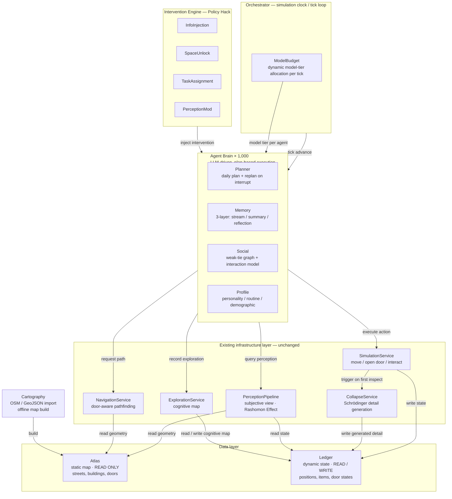

# Project Proposal
## Synthetic Socio Wind Tunnel: A Policy Hack Engine for Hyperlocal Boundary Penetration

**Submitted in response to:**
*Border Crossings: Instruments of Erasure and Infiltration*

**Submitted by:** [Your Name]
**Date:** March 2026
**Budget Requested:** $80,000 AUD

---

## 01 — Context: The Problem We Are Designing For

### The Hyperlocal

There is a word for the social scale that contemporary urban life has most completely erased: **hyperlocal** — the sub-kilometre radius within which a person's actual neighbours live, nearby spaces unfold, and everyday encounters happen. It is the smallest meaningful unit of community. It is also the scale that algorithms ignore, that attention skips over, and that design habitually treats as beneath notice.

In new-build residential precincts, residents occupy apartments separated by centimetres of concrete. They share corridors, lifts, train platforms, and supermarket queues. Yet community forums return the same posts, again and again: *"How do I actually meet my neighbours?"* / *"Why does living in an apartment block feel lonelier than being remote?"* / *"Does anyone know who lives next door?"*

This is not a housing problem. It is not an urban planning failure in the conventional sense. It is a **hyperlocal erasure** — the systematic destruction of the social ecology that exists at the sub-kilometre scale, perpetrated not by any single actor but by four invisible walls working in concert.

*The field site for this project has not been finalised. Phase 1 selects a precinct with mixed-to-moderate density — bounded, walkable, with accessible community groups. The criteria and selection process are described in §03.*

### Four Invisible Walls

We define the boundary not as a physical structure but as a layered, systemic condition that operates below conscious awareness:

```
┌──────────────────────────────────────────────────────────────────┐
│                    THE FOUR-LAYER INVISIBLE BOUNDARY             │
├──────────────────┬───────────────────────────────────────────────┤
│  Layer 1         │  DIGITAL ATTENTION WALL                       │
│  Mechanism →     │  Screens capture gaze; global news fills      │
│                  │  cognitive bandwidth                          │
│  Effect →        │  Physical environment within 1km becomes      │
│                  │  effectively invisible                        │
├──────────────────┼───────────────────────────────────────────────┤
│  Layer 2         │  ALGORITHMIC INFORMATION WALL                 │
│  Mechanism →     │  Recommendation engines suppress hyperlocal   │
│                  │  content (global events drive more clicks)    │
│  Effect →        │  Hyperlocal stories are systematically        │
│                  │  filtered out before they reach residents     │
├──────────────────┼───────────────────────────────────────────────┤
│  Layer 3         │  SPATIAL HABIT WALL                           │
│  Mechanism →     │  Optimised commute routes; urban design       │
│                  │  prioritises throughput over dwelling         │
│  Effect →        │  Public space reduced to transit corridor;    │
│                  │  serendipitous encounter becomes impossible   │
├──────────────────┼───────────────────────────────────────────────┤
│  Layer 4         │  SOCIAL PSYCHOLOGY WALL                       │
│  Mechanism →     │  Urban norm of non-interaction; stranger      │
│                  │  contact carries high perceived social risk   │
│  Effect →        │  Weak ties — Granovetter's connective tissue  │
│                  │  of social life — have collapsed entirely     │
└──────────────────┴───────────────────────────────────────────────┘
```

What is being erased by these boundaries is not just comfort or convenience. What is erased is *the hyperlocal* as a social ecology — the weak ties, third places, and serendipitous encounters that sociologists from Granovetter to Oldenburg have identified as foundational to individual wellbeing and collective resilience. All four walls converge on the same target: they each, in different ways, ensure that what is nearby remains invisible and inert.

The brief asks: what instruments can address erasure and enable infiltration? Our answer is: **you fight an algorithmic wall with an algorithmic tool — and you fight it at the hyperlocal scale.**

---

## 02 — Our Proposal: The Synthetic Socio Wind Tunnel

### The Core Idea

Before aerospace engineers bolt a new wing onto an aircraft, they test it in a wind tunnel. Before urban planners rebuild a public square, they could test social interventions in a *social* wind tunnel — a synthetic environment populated by AI agents whose behaviour approximates that of real residents, in a map that mirrors their actual neighbourhood.

**Synthetic Socio Wind Tunnel (SSWT)** is that wind tunnel.

It is a speculative-yet-functional AI multi-agent simulation system that:
1. Reconstructs a digitally-twinned urban neighbourhood (field site TBD; mixed/moderate-density precinct with manageable population) as a computational environment
2. Populates it with ~1,000 AI agents whose daily behaviours are calibrated against real demographic and ethnographic data
3. Injects *Policy Hack* interventions into the simulation — hyperlocal micro-digital stimuli, spatial unlocks, shared tasks
4. Measures whether and how those interventions dissolve the four-layer hyperlocal boundary
5. Generates visualisations, trajectory maps, and first-person narrative outputs that make the invisible visible

The system is not a prototype of an app. It is a **design research instrument** — one that produces evidence, stories, and design principles that can be taken back to real communities.

### What Makes This Different

Most design responses to social isolation either:
- Propose a new physical space (expensive, slow, often paternalistic)
- Propose a new digital platform (adds to the very attention economy that caused the problem)

SSWT takes neither route. It is built on the insight that **the same mechanisms that created invisible walls — algorithms, attention routing, digital nudges — can be turned against those walls.** We call this a *Policy Hack*: using the logic of the system to subvert the system's outcomes.

---

## 03 — Methodology

### Methodological Position

The hyperlocal is a scale that no single discipline owns. Studying it demands ethnographic sensitivity (to hear what residents actually experience), spatial rigour (to map where the invisibility is physically located), and computational modelling (to test interventions at population scale without deploying them). We assemble a bricolage from three traditions:

| Tradition | What We Borrow | Where It Appears |
|-----------|----------------|------------------|
| **Digital Ethnography** | Non-extractive listening; digital communities as field sites | Phase 1 |
| **Hyperlocal Design Research** | The sub-kilometre scale as the unit of analysis, intervention, and evaluation — every design decision is tested against whether it changes behaviour *within 1km* | All phases |
| **Agent-Based Modelling** | Simulation as a way to observe emergent social behaviour at population scale without real-world deployment | Phase 2–4 |

The overall frame is **speculative design**: the system is not a product to be shipped; it is a proposition about how the hyperlocal can be made legible and reactivated.

### The Five-Phase Process

```
 PHASE 1          PHASE 2          PHASE 3         PHASE 4          PHASE 5
 DIAGNOSIS        WORLD            CALIBRATION     EXPERIMENT       SYNTHESIS
 ─────────        ─────            ───────────     ──────────       ─────────

 Prove the        Build the        Run baseline    Inject Policy    Visualise,
 hyperlocal  →   synthetic    →   simulation  →   Hacks       →   narrate,
 is invisible     world            Verify          Measure          extract
 Select site      (map +           agent           hyperlocal       design
                  agents)          realism         deviation        principles

 2 weeks          3 weeks          2 weeks         4 weeks          3 weeks
```

### Phase 1 — Diagnosis: Rendering the Hyperlocal Visible

Before designing an instrument, we must prove that the hyperlocal has been erased — and choose the right terrain on which to test whether it can be recovered. We employ five parallel activities:

**1a. Site Selection**
We will survey candidate residential precincts using three criteria: (i) mixed-to-moderate density (not the highest-rise inner-city towers, which have outsized media attention and are harder to contact); (ii) bounded geography — a neighbourhood where one can walk edge-to-edge in under 20 minutes; (iii) accessible community groups — an active local Facebook group, Nextdoor community, or resident committee that can serve as a source of digital ethnography data and, optionally, informal collaborators. Two to three candidate sites will be visited in person before one is selected.

**1b. The Data Paradox (ABS Census)**
Cross-reference physical density (apartments/km²) against social fragility markers for the selected site: average tenancy duration <2 years, proportion of single-person households, residential turnover rates. The juxtaposition makes the paradox concrete and defensible.

**1c. Behavioural Mapping**
Field observation at the selected site to produce *Dwell Time Maps* — coded by line thickness (footfall) and circle size (average dwell duration). The expected finding: fat lines rush to transit nodes; the circles at street corners are near-zero.

**1d. Digital Anthropology**
Systematic trawl of Reddit, the target precinct's Facebook community groups, and Nextdoor for posts expressing social isolation, neighbour invisibility, or disconnection. These become evidence artefacts — the boundary's human cost, in residents' own words.

**1e. Exclusionary Infrastructure Analysis**
Map the commercial and spatial typology of the precinct against Oldenburg's *Third Place* criteria. Expected finding: near-total absence of spaces where strangers can dwell without purchasing something.

**Output of Phase 1:** A multi-evidence *Boundary Dossier* — the evidentiary case that this is a real, documented, multi-layered problem — plus a confirmed field site for Phase 2 onward.

### Phase 2 — World Building: The Synthetic Neighbourhood

Using OpenStreetMap data for the selected site, we construct a *digital twin* of the neighbourhood's spatial structure: streets, buildings, courtyards, commercial ground floors. This map is imported into the SSWT engine using its GeoJSON pipeline, enriched with:
- Spatial attributes (public/private, open/closed, dwell-encouraging/discouraging)
- Ambient properties (sound, light, smell — for the Rashomon perception layer)
- Social infrastructure markers (presence/absence of Third Places)

Simultaneously, we design the **Agent Population**. Calibrated against Phase 1 data, 1,000 agents are instantiated with:
- Demographic profiles drawn from census distributions
- Personality parameters (introversion/extroversion, curiosity, risk tolerance)
- Routine patterns (commute routes, working hours, shopping habits)
- Social network seeds (10 Protagonist agents with full relationship graphs; 990 dynamic agents with varying social distances)

**This is where the technical infrastructure earns its keep.** The engine's CQRS architecture separates the static map (Atlas) from dynamic state (Ledger), ensuring that adding or modifying agents never corrupts the spatial substrate. The perception pipeline's *Rashomon Effect* — same event, subjectively different experience per agent — is critical here: it is what allows the system to generate multi-voice narratives rather than a single omniscient account.

### Phase 3 — Calibration: The Baseline World

Before any intervention, we run the simulation to establish the *Before* state. A calibrated baseline exhibits:
- Agents following habitual, non-intersecting commute trajectories
- Near-zero social interaction events between non-acquainted agents
- Dead zones in public spaces (low agent density / dwell time)
- Isolated trajectory clusters corresponding to socio-demographic segments

If the simulation produces a believable representation of the site's social coldness, we have a working instrument. If agent behaviour deviates from ethnographic expectation, we revise the profile parameters. Calibration is iterative.

**Output of Phase 3:** Baseline heatmaps and trajectory maps — the *ACT I: BEFORE* visualisation set.

### Phase 4 — Experiments: Three Policy Hacks

We run three classes of hyperlocal intervention, each targeting a different layer of the boundary. A *Policy Hack* is not a product feature or a planning proposal — it is a minimal, reversible act that exploits a crack in the existing system to produce a disproportionate social effect.

**Experiment 1 — Digital Lure** *(targets Layer 1 & 2: Attention + Algorithm)*
Inject hyperlocal micro-news into agents' information stream: *"The bar 300m from you is giving away its last batch of craft beer tonight — 2 people who like the same music you do are already there."* The hack turns the algorithmic attention machine back toward the nearby. Measure: trajectory deviation, space activation in previously dead zones, new social ties formed.

**Experiment 2 — Spatial Unlock** *(targets Layer 3: Spatial Habit)*
Modify the Atlas map to open a previously locked passage between two residential clusters. Add a bench. The hack costs nothing and requires no permission — it asks only whether presence can be made possible where it was previously designed out. Measure: emergence of desire paths through the new opening, cross-cluster interaction events, territory of formerly isolated agent populations.

**Experiment 3 — Shared Perception** *(targets Layer 4: Social Psychology)*
Modify the ObserverContext of a subset of agents — give them a shared hidden task (find a lost cat; notice a specific piece of street art). The hack gives strangers a reason to be in the same hyperlocal moment, without forcing interaction. Measure: convergence of isolated agents at unexpected nodes, quality of encounters when strangers discover shared purpose.

Each experiment runs for 7–14 simulated days. Control groups (agents not receiving the intervention) run in parallel to establish counterfactual baselines.

**Output of Phase 4:** Before/After comparative visualisation pairs; event logs; statistical summaries of each intervention's effect size.

### Phase 5 — Synthesis: Making Data Legible

Raw trajectory data is powerful but cold. We translate it into a four-act output structure designed for multiple audiences:

```
ACT I   ──  BEFORE        Heatmaps of isolation; parallel, non-intersecting lines
ACT II  ──  INTERVENTION  The Policy Hack announced; parameters explained
ACT III ──  AFTER         Trajectory entanglement; space activation; new ties
ACT IV  ──  STORIES       Rashomon narratives — Emma's diary, Linda's diary,
                          the same encounter told from two isolated lives
```

The narrative layer (Act IV) is generated by the simulation's PerceptionPipeline, which renders each agent's subjective experience of the same event differently — filtered by their skills, emotional state, prior knowledge. These first-person accounts are the *instrument's proof of humanity*: evidence that what the numbers show is lived experience, not just data.

---

## 04 — Deliverables

| # | Deliverable | Format | Audience |
|---|-------------|--------|----------|
| D1 | **Boundary Dossier** | Visual report (12pp) | Client, community |
| D2 | **Synthetic Map** (selected site digital twin) | Interactive / static export | Research team |
| D3 | **Baseline simulation + calibration report** | Technical report | Research team |
| D4 | **Three Experiment Reports** (Before/After pairs) | Visual + data | Client, policy makers |
| D5 | **Rashomon Narrative Set** (3× multi-voice stories) | Print-ready Zine format | Public, exhibition |
| D6 | **Policy Hack Design Principles** | 1-page brief per hack | Urban practitioners |
| D7 | **System Interface Concept** | UI mockup | Future development |

---

## 05 — Outcomes

This project is designed to produce three types of outcome:

**Evidential:** Documented, measurable proof that hyperlocal digital stimuli alter social behaviour in predictable, reproducible ways — at simulated scale.

**Propositional:** A set of *Policy Hack* design principles — minimal hyperlocal interventions that urban planners, councils, and community organisations can apply without large-scale infrastructure investment.

**Speculative:** A working prototype of a social wind tunnel — demonstrating that AI simulation can become a legitimate tool in social design practice, enabling low-cost, low-harm testing of interventions before real-world deployment.

The ultimate outcome is not the system itself. It is the argument the system makes: **that the hyperlocal can be restored, that the invisible boundary can be penetrated, and that the instruments of penetration can be built from the same digital logic that constructed the wall.**

---

## 06 — Why Us: The Team

Our team brings an uncommon combination: social design sensibility, spatial thinking, and the technical capability to actually build and operate the simulation. These are not typical bedfellows in a design studio, and it is precisely that combination that this project demands.

```
```

We also want to be honest about what we are not: we are not sociologists, and we are not community workers. We will bring in a community liaison — a resident of the selected site — as a lightly-compensated collaborator and critical friend throughout the project. Their role is to pressure-test Agent profiles against lived experience, and to ensure the system reflects genuine community complexity rather than design school assumptions.

---

## 07 — Costing Sheet

**Hourly rate: $80/hr | Client budget: $80,000 | Estimated project cost: $19,384**

This project is compute-light and labour-efficient. The map engine and CQRS infrastructure already exist; we are configuring, populating, and running it — not building from scratch. Phase 1 includes direct fieldwork expenses (transport, food, interview sessions) for site selection and in-person observation. The substantial gap between estimated cost and client budget reflects genuine scope and is available as contingency for additional experiments, community engagement, or exhibition production.

### Labour — By Phase

| Phase | Description | Lead Designer | Spatial Designer | Sim Engineer | Narrative Designer | Phase Total |
|-------|-------------|:---:|:---:|:---:|:---:|:---:|
| 1 — Diagnosis | Site selection fieldwork, digital anthropology, census analysis, behavioural mapping | 8 hrs | 5 hrs | 2 hrs | 5 hrs | **20 hrs / $1,600** |
| 2 — World Building | Digital twin map, OSM import, agent profile design, LLM prompt engineering | 8 hrs | 18 hrs | 30 hrs | 9 hrs | **65 hrs / $5,200** |
| 3 — Calibration | Baseline simulation runs, behaviour verification, parameter tuning | 3 hrs | 5 hrs | 20 hrs | 2 hrs | **30 hrs / $2,400** |
| 4 — Experiments | 3× Policy Hack execution, monitoring, measurement, analysis | 12 hrs | 8 hrs | 20 hrs | 10 hrs | **50 hrs / $4,000** |
| 5 — Synthesis | Visualisation, Rashomon narrative set, deliverable production | 10 hrs | 12 hrs | 5 hrs | 8 hrs | **35 hrs / $2,800** |
| **Labour Total** | | **41 hrs** | **48 hrs** | **77 hrs** | **34 hrs** | **200 hrs / $16,000** |

### LLM API Token Costs

Token costs are a direct out-of-pocket expense, tracked separately from labour. Two distinct cost profiles apply: **build-phase costs** (all priced at Opus, reflecting the higher reasoning quality needed during map enrichment and prompt engineering) and **simulation run costs** (the dynamic Haiku/Sonnet gradient used at runtime).

**Model rates:**

| Model | Input | Output | Role |
|-------|-------|--------|------|
| Claude Haiku | $0.25 / 1M tokens | $1.25 / 1M tokens | 990 dynamic agents — routine daily operations |
| Claude Sonnet | $3.00 / 1M tokens | $15.00 / 1M tokens | 10 Protagonists + dynamically-upgraded interactions |
| Claude Opus | $15.00 / 1M tokens | $75.00 / 1M tokens | All build & prompt-engineering calls |

---

**BUILD PHASE — Opus pricing (Phase 2–3)**

The build phase is more expensive than it looks. Map enrichment requires generating rich spatial descriptions, ambient properties, and sensory atmosphere for every location, then iterating until quality is consistent. Agent profile generation requires at least two to three revision rounds to produce 1,000 believably distinct personalities. All of this runs at Opus.

| Activity | Calls (est.) | Avg tokens (in + out) | Opus cost |
|----------|-------------|----------------------|----------|
| Map LLM enrichment: ~350 locations (descriptions, atmosphere, sounds, smells) | 350 initial + ~150 regenerations = **500 calls** | 2,200 in + 1,800 out | $500 × (2,200 × $15 + 1,800 × $75) / 1M = **$500 × $0.033 + $0.135 = $84** |
| Agent profile batch generation: 1,000 profiles × 2 iteration rounds | **2,000 calls** | 1,500 in + 1,000 out | $2,000 × (1,500 × $15 + 1,000 × $75) / 1M = **$2,000 × $0.0225 + $0.075 = $195** |
| Planner prompt engineering (daily plan prompt iteration) | **400 calls** | 3,000 in + 1,500 out | $400 × ($0.045 + $0.1125) = **$63** |
| Social interaction & Policy Hack prompt testing | **300 calls** | 2,500 in + 1,200 out | $300 × ($0.0375 + $0.09) = **$38** |
| **Build total** | **~3,200 calls** | | **~$380** |

---

**SIMULATION RUNS — Haiku / Sonnet gradient**

The per-day cost differs meaningfully between calibration days (no intervention, low Sonnet usage) and experiment days (Policy Hack active, Sonnet upgrade rate elevated).

*Calibration day — no Policy Hack, baseline behaviour:*

| Call type | Calls/day | Model | Input | Output | Cost |
|-----------|-----------|-------|-------|--------|------|
| Daily plan generation | 990 | Haiku | 990 × 1,800 = 1,782K | 990 × 600 = 594K | $0.45 + $0.74 = $1.19 |
| Daily plan generation | 10 | Sonnet | 10 × 2,500 = 25K | 10 × 800 = 8K | $0.08 + $0.12 = $0.20 |
| Replanning (routine disruptions only) | 80 | Haiku | 80 × 2,000 = 160K | 80 × 600 = 48K | $0.04 + $0.06 = $0.10 |
| Replanning (near Protagonist) | 15 | Sonnet | 15 × 2,000 = 30K | 15 × 600 = 9K | $0.09 + $0.14 = $0.23 |
| Social dialogue | 150 | Haiku | 150 × 1,800 = 270K | 150 × 1,000 = 150K | $0.07 + $0.19 = $0.26 |
| Social dialogue (upgraded) | 20 | Sonnet | 20 × 2,500 = 50K | 20 × 1,500 = 30K | $0.15 + $0.45 = $0.60 |
| Memory summarisation | 90 Haiku + 10 Sonnet | Mix | 225K + 40K | 45K + 8K | $0.19 |
| **Calibration day total** | | | | | **~$2.77** |

*Experiment day — Policy Hack active, elevated Sonnet usage:*

| Call type | Calls/day | Model | Input | Output | Cost |
|-----------|-----------|-------|-------|--------|------|
| Daily plan generation | 990 | Haiku | 1,782K | 594K | $1.19 |
| Daily plan generation | 10 | Sonnet | 25K | 8K | $0.20 |
| Replanning (Policy Hack triggers ~100 Haiku + ~50 Sonnet upgrades) | 150 | Mix | 300K + 125K | 90K + 38K | $0.19 + $0.57 = $0.76 |
| Social dialogue (more encounters in activated spaces) | 200 Haiku + 60 Sonnet | Mix | 360K + 180K | 200K + 108K | $0.34 + $2.16 = $2.50 |
| Memory summarisation | 90 Haiku + 10 Sonnet | Mix | 225K + 40K | 45K + 8K | $0.19 |
| **Experiment day total** | ~1,570 calls | | ~3,235K | ~1,091K | **~$4.84** |

*Note: experiment day is ~75% more expensive than calibration day, driven by Sonnet social dialogue costs.*

**Production run costs:**

| Run | Days | Rate | Total |
|-----|------|------|-------|
| Calibration (baseline, iterated) | 15 | $2.77 | $42 |
| Experiment 1 — Digital Lure | 14 | $4.84 | $68 |
| Experiment 2 — Spatial Unlock | 14 | $4.84 | $68 |
| Experiment 3 — Shared Perception | 14 | $4.84 | $68 |
| **Production total** | **57 sim-days** | | **$246** |

---

**OTHER TOKEN COSTS**

| Item | Cost |
|------|------|
| Rashomon narrative generation (D5): ~80 Sonnet calls × (3,500 in + 2,500 out) | $0.28 + $3.00 = **$27** |
| Re-run buffer (50% of production, for failed calibrations and variant runs) | **$123** |

---

**TOKEN COST SUMMARY**

| Category | Cost |
|----------|------|
| Build phase (Opus) | $380 |
| Production runs — calibration | $42 |
| Production runs — 3 experiments | $204 |
| Narrative generation (D5) | $27 |
| Re-run buffer (50%) | $123 |
| **Token Total** | **$776** |

### Fieldwork Direct Costs (Phase 1)

Phase 1 requires multiple in-person visits to candidate and selected sites — for behavioural mapping, dwell-time observation, and informal community engagement. These costs are direct out-of-pocket expenses, separate from labour.

| Item | Detail | Est. Cost |
|------|--------|-----------|
| Transport | 3–4 site reconnaissance visits × return trip (~$20–35 each) | $100 |
| Food & coffee | Observation sessions (researcher on-site 4–6 hrs = café as workplace) | $150 |
| Interview incentives | Informal conversations with 5–8 residents (~$15–20 coffee voucher each) | $120 |
| Community liaison support | Token appreciation for the informal community collaborator | $80 |
| Printing & materials | Field maps, dossier drafts, printed stimuli for resident feedback | $50 |
| Buffer (10%) | | $50 |
| **Fieldwork Total** | | **$550** |

### Budget Summary

| Category | Cost |
|----------|------|
| Labour (200 hrs × $80/hr) | $16,000 |
| LLM API tokens | $776 |
| Phase 1 fieldwork (transport, food, interviews) | $550 |
| Deliverable production (Zine print, report binding) | $300 |
| Contingency (10%) | $1,758 |
| **Estimated Project Total** | **$19,384** |
| Client budget | $80,000 |
| **Remaining (available for scope extension)** | **$60,616** |

### Timeline (14 Weeks)

```
WEEK  1  2  3  4  5  6  7  8  9  10 11 12 13 14
      │  │  │  │  │  │  │  │  │  │  │  │  │  │
Ph 1  ████████                                    Diagnosis
Ph 2        ████████████                          World Building
Ph 3                    ████████                  Calibration
Ph 4                          ██████████████      Experiments
Ph 5                                  ████████    Synthesis
Milestones:
  ▲ Wk2: Boundary Dossier draft
  ▲ Wk5: Map + agent profiles locked
  ▲ Wk7: Calibration sign-off
  ▲ Wk11: Experiment results
  ▲ Wk14: All deliverables
```

---

## 08 — Assumptions & Scope

### In Scope
- Site selection (Phase 1) followed by simulation of the confirmed precinct (~1 km² focus area; mixed/moderate density)
- 1,000 AI agents running on LLM infrastructure (Claude Haiku/Sonnet gradient)
- Three Policy Hack experiments as described
- All deliverables (D1–D7) listed in Section 04
- LLM API costs (itemised separately in the token cost table in Section 07)

### Out of Scope
- Real-world implementation or community deployment of any intervention
- Mobile application or public-facing digital product
- Legal or planning approvals for any spatial change
- Primary data collection through formal surveys or ethics-approved interviews (we use publicly available digital traces and observational methods only)
- Long-term maintenance of the simulation system post-delivery

### Key Assumptions
1. OSM data for the selected site is sufficiently detailed for spatial modelling (if not, we use a simplified schematic map)
2. Publicly available Reddit/Facebook community data is sufficient for Digital Anthropology phase without formal ethics review
3. The client accepts speculative simulation output as valid design research evidence
4. LLM API access remains available and cost-stable throughout the project
5. At least one local community member is willing to participate informally as a critical collaborator (lightly compensated; estimated 4–6 hrs of their time across the project)

### Risk Register

| Risk | Likelihood | Mitigation |
|------|-----------|------------|
| Agent behaviour too stylised / unrealistic | Medium | Iterative calibration against ethnographic data in Phase 3; community collaborator review |
| LLM outputs reinforce demographic stereotypes | Medium | Explicit bias review of all Agent profiles; human editorial pass on narrative outputs |
| Scope creep into product design | Low | Clear scope boundary defined above; client sign-off at Phase 2 milestone |
| OSM data gaps | Low | Fallback to schematic representation; precedent set by existing engine tests |

---

## 09 — A Note on Ethics

We are building a simulation of real communities using real demographic patterns. We take this seriously.

Agent profiles will not be based on individually identifiable people. Demographic distributions (age, household type, tenure, cultural background) will be drawn from census aggregates, not from individual data. The Digital Anthropology phase collects publicly visible posts, not private messages.

The narrative outputs (Rashomon stories) are *fictional* accounts generated by AI, inspired by but not reproducing any real person's words. They will be clearly labelled as speculative fiction.

We believe the greatest ethical risk in this project is not data misuse, but **representation failure** — designing agents that flatten the genuine complexity of who actually lives in the selected neighbourhood. Our mitigation is the community collaborator, and our commitment to making Agent profile assumptions explicit and reviewable at every stage.

---

## 10 — Closing: The Argument This Project Makes

The boundary we are designing against is not a wall you can knock down. It is a condition produced by the accumulated weight of a thousand daily decisions — which app to open, which route to take, whether to make eye contact in a lift. Each decision erodes the hyperlocal a little further. No single intervention dissolves that accumulation. But the right instrument can reveal where its load-bearing points are — and which minimal hack, applied at the right hyperlocal node, produces the largest social return.

Synthetic Socio Wind Tunnel is that instrument. It is rigorous where it needs to be rigorous, and speculative where speculation is warranted. It uses the tools of the attention economy to illuminate what the attention economy has destroyed. And it offers something most social design proposals cannot: *a way to test the hyperlocal before you touch it.*

We are ready to begin.

---

*Proposal submitted by: [Your Name]*
*[Your Student ID]*
*[Course / Studio Name]*
*March 2026*

---

**Appendix A: Technical Architecture Reference**



**Appendix B: Glossary of Key Terms**

| Term | Definition |
|------|------------|
| **Policy Hack** | Achieving social change by subverting algorithmic/spatial rules without physical reconstruction |
| **Hyperlocal** | The sub-kilometre social scale at which neighbours, nearby spaces, and everyday encounters exist — the scale algorithms ignore and this project works to reactivate |
| **The Nearby** | The eroded social ecology of immediate physical surroundings |
| **Weak Ties** | Acquaintances (not close friends) who are, per Granovetter, the connective tissue of social opportunity |
| **Third Places** | Social venues beyond home and work (Oldenburg); often absent or commercialised in new-build residential precincts |
| **Rashomon Effect** | The same event experienced and narrated differently by different observers |
| **Atlas / Ledger** | SSWT engine terms: static map layer (read-only) / dynamic state layer (read-write) |
| **Agent** | An AI-driven synthetic resident with a unique profile, memory, and decision-making process |
