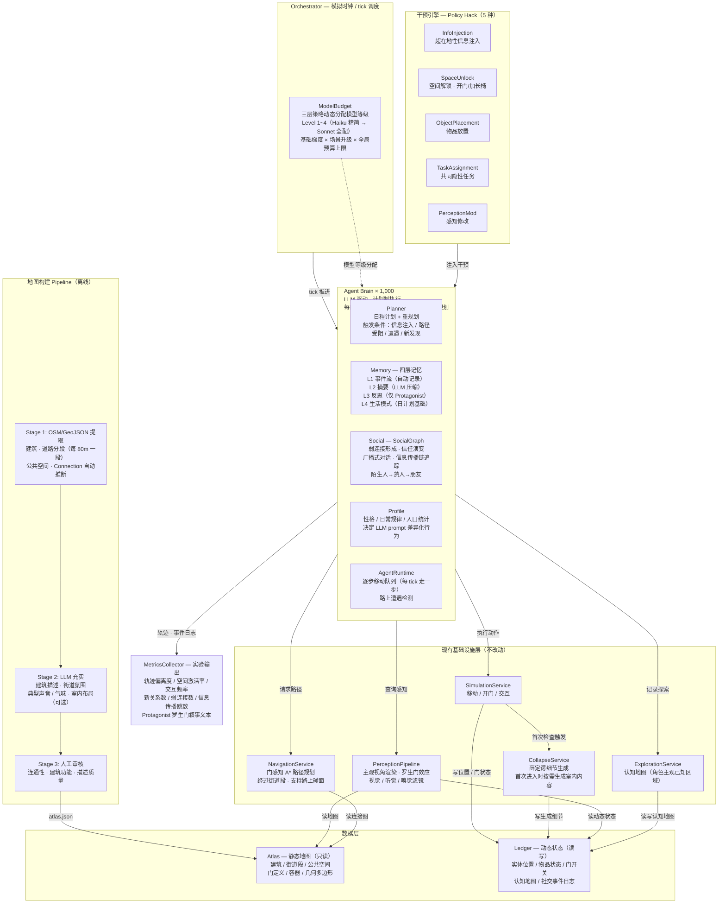

# 项目提案
## Synthetic Socio Wind Tunnel：超在地性边界渗透的政策破解引擎

**提交响应：**
*Border Crossings: Instruments of Erasure and Infiltration*（跨越边界：抹除与渗透的工具）

**提交人：** [你的姓名]
**日期：** 2026年3月
**申请预算：** 澳元 $80,000

---

## 01 — 背景：我们正在为之设计的问题

### 超在地性

当代城市生活摧毁得最彻底的社会尺度，有一个专有名词：**超在地性（Hyperlocal）**——以人为中心、半径不足一公里的范围，真实的邻居住在这里，附近的空间在这里展开，日常的相遇在这里发生。这是社区存在的最小有意义单元。也恰恰是算法漠视、注意力跳过、设计习惯性视而不见的尺度。

在新建住宅区，居民住在仅几厘米混凝土之隔的公寓里。他们共用走廊、电梯、火车站台和超市队伍。然而社区论坛上，同样的帖子一遍遍出现：*"怎么认识自己的邻居？"* / *"住在公寓楼里为什么比住在偏远地方还孤独？"* / *"有没有人知道隔壁住的是谁？"*

这不是住房问题。从通常意义上说，这也不是城市规划的失败。这是一场**超在地性抹除**——对半公里尺度内社会生态的系统性摧毁，没有任何单一主体蓄意为之，而是四堵隐形的墙协同造就的结果。

*本项目的具体场地尚未最终确定。第一阶段将选择中等密度、边界清晰、社区组织可及的街区。选址标准与流程详见第 03 节。*

### 四堵隐形的墙

我们将边界定义为一种分层的、系统性的状态，而非物理结构，它在意识察觉之下悄然运作：

```
┌──────────────────────────────────────────────────────────────────┐
│                         四层隐形边界                              │
├──────────────────┬───────────────────────────────────────────────┤
│  第一层           │  数字注意力之墙                               │
│  机制 →          │  屏幕捕获视线；全球新闻占据认知带宽            │
│  后果 →          │  1公里内的物理环境实际上变得不可见              │
├──────────────────┼───────────────────────────────────────────────┤
│  第二层           │  算法信息之墙                                 │
│  机制 →          │  推荐引擎压制超在地性内容（全球事件带来更多点击）│
│  后果 →          │  超在地性故事在抵达居民之前就被系统性过滤掉    │
├──────────────────┼───────────────────────────────────────────────┤
│  第三层           │  空间习惯之墙                                 │
│  机制 →          │  优化的通勤路线；城市设计优先吞吐量而非驻留    │
│  后果 →          │  公共空间沦为通勤走廊；偶遇变得不可能          │
├──────────────────┼───────────────────────────────────────────────┤
│  第四层           │  社交心理之墙                                 │
│  机制 →          │  城市非互动规范；与陌生人接触被认为风险极高    │
│  后果 →          │  弱连接——格拉诺维特所说的社会生活结缔组织      │
│                  │  已彻底瓦解                                   │
└──────────────────┴───────────────────────────────────────────────┘
```

被这些边界所抹除的，不仅仅是舒适或便利。被抹除的是*超在地性*本身作为一种社会生态——从格拉诺维特到奥尔登堡，社会学家们已反复证明，弱连接、第三空间和意外相遇是个人福祉与集体韧性的根基。四堵墙指向同一个靶心：它们各以不同的方式，确保附近的一切持续保持不可见、保持惰性。

任务书问的是：什么工具能应对抹除、实现渗透？我们的回答是：**用算法的工具对抗算法的高墙——并在超在地性的尺度上与之对抗。**

---

## 02 — 我们的提案：Synthetic Socio Wind Tunnel

### 核心理念

航空工程师在把新翼型安装到飞机上之前，会先在风洞里测试。城市规划者在重建一个公共广场之前，也可以在*社会*风洞里测试干预方案——一个由AI智能体组成的合成环境，智能体的行为近似于真实居民，地图则映射了他们实际的社区。

**Synthetic Socio Wind Tunnel（SSWT）**就是这个风洞。

它是一个推测性但可运行的AI多智能体模拟系统，能够：
1. 将一个城市社区（场地待定；中等密度、人口规模可控的街区）以数字孪生的形式重建为计算环境
2. 向其中填入约 1,000 个 AI 智能体，其日常行为依据真实人口统计和民族志数据校准
3. 向模拟中注入*政策破解*干预——超在地性微型数字刺激、空间解锁、共同任务
4. 测量这些干预是否以及如何消解四层超在地性边界
5. 生成可视化图像、轨迹图和第一人称叙事输出，让不可见的东西变得可见

这个系统不是某款应用的原型。它是一件**设计研究工具**——产出证据、故事和设计原则，可以被带回真实社区。

### 与众不同之处

大多数针对社会孤立的设计回应，要么：
- 提议新建一处物理空间（代价高昂、进展迟缓，且往往带有家长制色彩）
- 提议一个新的数字平台（进一步强化了造成这一问题的注意力经济）

SSWT 两条路都不走。它建立在这样一个洞察之上：**制造隐形高墙的那些机制——算法、注意力路由、数字助推——可以被反过来用于对抗这些高墙。** 我们称之为*政策破解（Policy Hack）*：用系统的逻辑颠覆系统的结果。

---

## 03 — 方法论

### 方法论立场

超在地性是一个没有任何单一学科独占的尺度。研究它需要民族志的敏感性（倾听居民的真实体验）、空间的严谨性（绘制出不可见性在物理上的位置），以及计算建模（在不实际部署的情况下，于人口规模上测试干预效果）。我们从三种传统中拼贴出一套方法：

| 传统 | 我们借鉴的内容 | 体现阶段 |
|------|--------------|---------|
| **数字民族志** | 非剥削性倾听；数字社群作为田野场地 | 第一阶段 |
| **超在地性设计研究** | 以半公里尺度作为分析、干预和评估的基本单元——每一个设计决策都以"它能否改变1公里内的行为"来检验 | 全阶段 |
| **基于智能体的建模** | 模拟作为在人口规模上、无需真实部署即可观察涌现式社会行为的途径 | 第二至四阶段 |

整体框架是**推测设计**：系统不是一个待发布的产品，而是一个关于超在地性如何可以被显现并重新激活的命题。

### 五阶段流程

```
 第一阶段          第二阶段          第三阶段         第四阶段          第五阶段
 诊 断            世界构建          校 准            实 验             综 合
 ─────            ────             ────             ────             ────

 证明超在地性  →  构建合成      →  运行基线     →  注入政策     →  可视化、
 已被抹除         世界              模拟              破解              叙事、
 选定场地         （地图+          验证智能体        测量超在地        提炼设计
                  智能体）         行为真实性         偏离              原则

 2周               3周              2周              4周              3周
```

### 第一阶段——诊断：让超在地性变得可见

设计工具之前，必须先证明超在地性已被抹除——并选定合适的场地，测试它是否能够被恢复。我们采用五条并行活动路径：

**1a. 场地选择**
我们将依据三项标准考察候选住宅街区：(i) 中等密度（而非最高密度的内城塔楼，后者媒体曝光过多，居民也难以接触）；(ii) 边界清晰——步行可以穿越全区，不超过20分钟；(iii) 社区可及——有活跃的本地 Facebook 群组、Nextdoor 社区或居民委员会，可作为数字民族志数据来源，也可在后续阶段联系非正式合作者。在确定最终场地前，将对 2-3 个候选场地进行实地踏勘。

**1b. 数据悖论（澳大利亚统计局人口普查）**
将物理密度（公寓数/平方公里）与社会脆弱性指标交叉比对：平均租住期限不足2年、单人家庭比例、居民流动率。两者的并置让这一悖论变得具体且可辩护。

**1c. 行为映射**
在选定场地进行实地观察，绘制*驻留时间图*——以线条粗细表示人流量，以圆圈大小表示平均驻留时长。预期发现：粗线条向公共交通节点奔涌；街角的圆圈几乎为零。

**1d. 数字人类学**
系统性地搜集 Reddit、目标街区社区 Facebook 群组和 Nextdoor 上表达社会孤立感、邻里陌生感或社区脱节的帖子。这些内容成为证据文物——边界人类代价的真实呈现，以居民自己的语言书写。

**1e. 排他性基础设施分析**
依据奥尔登堡的*第三空间*标准，对该区域的商业形态和空间类型进行映射。预期发现：陌生人无需消费即可驻留的空间几乎完全缺失。

**第一阶段产出：** 多维证据构成的*边界档案*——证明这是一个真实的、有据可查的、多层次问题的证据链——以及确认的第二阶段起始场地。

### 第二阶段——世界构建：合成社区

利用选定场地的 OpenStreetMap 数据，我们构建该社区空间结构的*数字孪生*：街道、建筑、庭院、底层商业。该地图通过 SSWT 引擎的 GeoJSON 导入管线载入，并被赋予以下属性：
- 空间属性（公共/私人、开放/封闭、鼓励驻留/不鼓励驻留）
- 环境属性（声音、光线、气味——用于罗生门感知层）
- 社会基础设施标记（第三空间的存在与缺失）

与此同时，我们设计**智能体种群**。依据第一阶段数据校准，1,000 个智能体被实例化，各自具备：
- 基于人口普查分布的人口统计画像
- 性格参数（内向/外向、好奇心、风险承受度）
- 日常规律（通勤路线、工作时长、购物习惯）
- 社交网络种子（10 个具备完整关系图谱的主角智能体；990 个社交距离各异的动态智能体）

**这正是技术基础设施体现其价值的地方。** 引擎的 CQRS 架构将静态地图（Atlas）与动态状态（Ledger）分离，确保智能体的增减或修改永远不会破坏空间底层数据。感知管线的*罗生门效应*——同一事件，每个智能体主观体验各异——在此至关重要：正是它让系统能够生成多声部叙事，而非单一的全知视角。

### 第三阶段——校准：基线世界

在任何干预之前，我们先运行模拟以确立*之前*状态。一个经过校准的基线应呈现：
- 智能体遵循习惯性的、互不交叉的通勤轨迹
- 陌生智能体之间的社交互动事件接近于零
- 公共空间中的死区（智能体密度低/驻留时间短）
- 与社会人口学分组对应的孤立轨迹簇

如果模拟产生了该场地社会冷漠状态的可信再现，我们便拥有了一件可用的工具。如果智能体行为偏离民族志预期，则修订画像参数。校准是迭代进行的。

**第三阶段产出：** 基线热力图和轨迹图——即*第一幕：之前*可视化组。

### 第四阶段——实验：三项政策破解

我们运行三类超在地性干预，每类针对边界的不同层次。*政策破解*不是一个产品功能，也不是一份规划提案——它是一种最小化的、可逆的行动，利用现有系统中的某条裂缝，产生不成比例的社会效应。

**实验一——数字诱饵**（*针对第一、二层：注意力 + 算法*）
向智能体的信息流注入超在地性微型新闻：*"距离你300米的酒吧今晚赠送最后一批精酿啤酒——已有2位与你音乐口味相同的人在那里了。"* 这个破解将算法注意力机器重新转向附近。测量指标：轨迹偏离、原死区的空间激活、新社交关系的形成。

**实验二——空间解锁**（*针对第三层：空间习惯*）
修改 Atlas 地图，开放两个住宅群落之间原本锁闭的通道，并放置一条长椅。这个破解不花一分钱、不需要任何许可——它只问一件事：能否在原本被设计排除在外的地方，让"在场"成为可能。测量指标：新通道中欲望路径的涌现、跨群落互动事件、原本孤立的智能体种群的领域变化。

**实验三——共同感知**（*针对第四层：社交心理*）
修改部分智能体的 ObserverContext（观察者上下文）——赋予他们一项共同的隐藏任务（寻找一只走失的猫；注意一件特定的街头艺术）。这个破解给了陌生人一个共处于同一超在地性时刻的理由，而无需强迫任何互动。测量指标：孤立智能体在意想不到的节点上的汇聚、陌生人发现共同目的时相遇的质量。

每项实验运行 7-14 个模拟天。未接受干预的对照组同步运行，以建立反事实基线。

**第四阶段产出：** 前后对比可视化组；事件日志；每项干预效果量的统计摘要。

### 第五阶段——综合：让数据变得可读

原始轨迹数据强大但冰冷。我们将其转译为面向多类受众的四幕输出结构：

```
第一幕  ──  之前        孤立的热力图；平行、互不交叉的线条
第二幕  ──  干预        政策破解宣告；参数说明
第三幕  ──  之后        轨迹缠绕；空间激活；新关系形成
第四幕  ──  故事        罗生门叙事——Emma 的日记、Linda 的日记，
                        同一次相遇，由两段孤立的生命各自讲述
```

叙事层（第四幕）由模拟的 PerceptionPipeline 生成，它以不同方式渲染每个智能体对同一事件的主观体验——经由其技能、情绪状态、既有认知的过滤。这些第一人称叙事是*工具对人性的证明*：证明数字所呈现的是真实的生活体验，而非单纯的数据。

---

## 04 — 交付物

| # | 交付物 | 格式 | 受众 |
|---|--------|------|------|
| D1 | **边界档案** | 可视化报告（12页） | 客户、社区 |
| D2 | **合成地图**（选定场地数字孪生） | 交互式/静态导出 | 研究团队 |
| D3 | **基线模拟 + 校准报告** | 技术报告 | 研究团队 |
| D4 | **三项实验报告**（前后对比组） | 可视化 + 数据 | 客户、政策制定者 |
| D5 | **罗生门叙事集**（3×多声部故事） | 印刷就绪的 Zine 格式 | 公众、展览 |
| D6 | **政策破解设计原则** | 每项破解一页简报 | 城市从业者 |
| D7 | **系统界面概念** | UI 效果图 | 未来开发 |

---

## 05 — 成果

本项目旨在产出三类成果：

**证据性成果：** 有据可查、可量化的证明——超在地性数字刺激能够以可预测、可重复的方式改变社会行为——在模拟规模上。

**命题性成果：** 一套*政策破解*设计原则——最小化的超在地性干预，城市规划者、市政机构和社区组织无需大规模基础设施投入即可应用。

**推测性成果：** 一个可运行的社会风洞原型——证明 AI 模拟可以成为社会设计实践中的合法工具，在真实部署之前实现低成本、低伤害的干预测试。

最终成果不是系统本身。而是系统所阐明的论点：**超在地性可以被恢复，无形的边界可以被渗透，而渗透的工具可以用构筑那道高墙的同一套数字逻辑来建造。**

---

## 06 — 为什么是我们：团队介绍

我们的团队具备一种罕见的组合：社会设计的感受力、空间思维，以及真正构建和运行模拟系统的技术能力。这些能力在设计工作室中并不常常同处一室，而这恰恰是本项目所必需的组合。

```
┌─────────────────────────────────────────────────────────────────┐
│                           团队成员                               │
├──────────────────────┬──────────────────────────────────────────┤
│  [姓名]              │  首席设计师 / 研究总监                    │
│                      │  负责：项目框架梳理、民族志研究、          │
│                      │  成果综合、客户沟通                       │
│                      │  专长：社会设计、系统思维、城市研究        │
├──────────────────────┼──────────────────────────────────────────┤
│  [姓名]              │  空间与视觉设计师                         │
│                      │  负责：数字孪生地图、可视化设计、          │
│                      │  产出物料制作                            │
│                      │  专长：GIS、数据可视化、城市测绘          │
├──────────────────────┼──────────────────────────────────────────┤
│  [姓名]              │  模拟工程师                               │
│                      │  负责：智能体系统构建、LLM 集成、          │
│                      │  实验执行                                │
│                      │  专长：Python、AI/LLM 系统、基于智能体的建模│
├──────────────────────┼──────────────────────────────────────────┤
│  [姓名]              │  叙事与参与式设计师                       │
│                      │  负责：罗生门产出、社区参与设计、Zine      │
│                      │  专长：推测设计、写作、参与式方法          │
└──────────────────────┴──────────────────────────────────────────┘
```

我们也希望坦诚地说明我们不是什么：我们不是社会学家，也不是社区工作者。我们将邀请一位社区联络员——一位选定场地的居民——作为轻度补偿的合作者和批判性朋友全程参与项目。他们的角色是将智能体画像与真实生活经验进行压力测试，并确保系统反映真实的社区复杂性，而非设计学院的假设。

---

## 07 — 成本表

**时薪：$80/小时 | 客户预算上限：$80,000 | 项目预计总成本：$19,384**

本项目计算量轻、人工高效。地图引擎和 CQRS 基础设施已存在；我们的工作是配置、填充并运行它，而非从零构建。第一阶段包含实地田野调查的直接成本（交通、餐饮、访谈）用于场地选择和现场观察。预计成本与客户预算之间的巨大差额是真实的——剩余资金可用于增加实验轮次、社区参与或展览制作。

### 人工费——按阶段分解

| 阶段 | 描述 | 首席设计师 | 空间设计师 | 模拟工程师 | 叙事设计师 | 阶段小计 |
|------|------|:---:|:---:|:---:|:---:|:---:|
| 1 — 诊断 | 场地选择田野调查、数字人类学、人口普查分析、行为映射 | 8 小时 | 5 小时 | 2 小时 | 5 小时 | **20 小时 / $1,600** |
| 2 — 世界构建 | 数字孪生地图、OSM 导入、智能体画像设计、LLM 提示词工程 | 8 小时 | 18 小时 | 30 小时 | 9 小时 | **65 小时 / $5,200** |
| 3 — 校准 | 基线模拟运行、行为验证、参数调优 | 3 小时 | 5 小时 | 20 小时 | 2 小时 | **30 小时 / $2,400** |
| 4 — 实验 | 3×政策破解执行、监控、测量、分析 | 12 小时 | 8 小时 | 20 小时 | 10 小时 | **50 小时 / $4,000** |
| 5 — 综合 | 可视化生产、罗生门叙事集、交付物设计 | 10 小时 | 12 小时 | 5 小时 | 8 小时 | **35 小时 / $2,800** |
| **人工合计** | | **41 小时** | **48 小时** | **77 小时** | **34 小时** | **200 小时 / $16,000** |

### LLM API Token 费用

Token 费用是直接实付成本，独立于人工费单独列明。成本结构分为两部分：**构建阶段费用**（全部按 Opus 计费，反映地图 enrichment 和提示词工程所需的更高推理质量）和**模拟运行费用**（运行时使用 Haiku/Sonnet 动态梯度）。

**使用模型及定价：**

| 模型 | 输入 | 输出 | 用途 |
|------|------|------|------|
| Claude Haiku | $0.25 / 百万 token | $1.25 / 百万 token | 990 个动态智能体——日常操作 |
| Claude Sonnet | $3.00 / 百万 token | $15.00 / 百万 token | 10 个主角 + 动态升级的互动 |
| Claude Opus | $15.00 / 百万 token | $75.00 / 百万 token | 全部构建与提示词工程调用 |

---

**构建阶段——Opus 计费（第 2–3 阶段）**

构建阶段的成本比表面看起来要高。地图 enrichment 需要为每个空间生成详细的空间描述、环境氛围和感官属性，并反复迭代直到质量稳定。智能体画像生成需要至少两到三轮修订，才能产出 1,000 个有辨识度的独特性格。所有这些均按 Opus 计费。

| 活动 | 估算调用次数 | 平均 token（输入+输出） | Opus 费用 |
|------|-----------|------------------|---------|
| 地图 LLM enrichment：约 350 个空间（描述、氛围、声音、气味） | 350 初次生成 + 约 150 次重新生成 = **500 次** | 2,200 in + 1,800 out | $500 × (2,200 × $15 + 1,800 × $75) / 1M = **$500 × $0.033 + $0.135 = $84** |
| 智能体画像批量生成：1,000 个画像 × 2 轮迭代 | **2,000 次** | 1,500 in + 1,000 out | $2,000 × (1,500 × $15 + 1,000 × $75) / 1M = **$2,000 × $0.0225 + $0.075 = $195** |
| 日程计划提示词工程（迭代调优） | **400 次** | 3,000 in + 1,500 out | $400 × ($0.045 + $0.1125) = **$63** |
| 社交互动与政策破解提示词测试 | **300 次** | 2,500 in + 1,200 out | $300 × ($0.0375 + $0.09) = **$38** |
| **构建合计** | **约 3,200 次** | | **约 $380** |

---

**模拟运行——Haiku / Sonnet 梯度**

校准日（无干预、Sonnet 升级率低）和实验日（政策破解激活、Sonnet 升级大幅增加）的每日成本存在显著差异。

*校准日——无政策破解，基线行为：*

| 调用类型 | 调用数/天 | 模型 | 输入 | 输出 | 费用 |
|---------|---------|------|------|------|------|
| 日程计划生成 | 990 | Haiku | 990 × 1,800 = 1,782K | 990 × 600 = 594K | $0.45 + $0.74 = $1.19 |
| 日程计划生成 | 10 | Sonnet | 10 × 2,500 = 25K | 10 × 800 = 8K | $0.08 + $0.12 = $0.20 |
| 重规划（常规干扰） | 80 | Haiku | 80 × 2,000 = 160K | 80 × 600 = 48K | $0.04 + $0.06 = $0.10 |
| 重规划（主角附近升级） | 15 | Sonnet | 15 × 2,000 = 30K | 15 × 600 = 9K | $0.09 + $0.14 = $0.23 |
| 社交对话 | 150 | Haiku | 150 × 1,800 = 270K | 150 × 1,000 = 150K | $0.07 + $0.19 = $0.26 |
| 社交对话（升级） | 20 | Sonnet | 20 × 2,500 = 50K | 20 × 1,500 = 30K | $0.15 + $0.45 = $0.60 |
| 记忆摘要 | 90 Haiku + 10 Sonnet | 混合 | 225K + 40K | 45K + 8K | $0.19 |
| **校准日合计** | | | | | **约 $2.77** |

*实验日——政策破解激活，Sonnet 升级率提升：*

| 调用类型 | 调用数/天 | 模型 | 输入 | 输出 | 费用 |
|---------|---------|------|------|------|------|
| 日程计划生成 | 990 | Haiku | 1,782K | 594K | $1.19 |
| 日程计划生成 | 10 | Sonnet | 25K | 8K | $0.20 |
| 重规划（政策破解触达约100人 + 主角附近50人升级） | 150 | 混合 | 300K + 125K | 90K + 38K | $0.19 + $0.57 = $0.76 |
| 社交对话（激活空间中接触增加） | 200 Haiku + 60 Sonnet | 混合 | 360K + 180K | 200K + 108K | $0.34 + $2.16 = $2.50 |
| 记忆摘要 | 90 Haiku + 10 Sonnet | 混合 | 225K + 40K | 45K + 8K | $0.19 |
| **实验日合计** | 约 1,570 次 | | 约 3,235K | 约 1,091K | **约 $4.84** |

*注：实验日费用约为校准日的 1.75 倍，主要由 Sonnet 社交对话成本驱动。*

**正式运行成本：**

| 运行阶段 | 模拟天数 | 单日费用 | 小计 |
|---------|--------|---------|------|
| 校准（基线，含迭代） | 15 天 | $2.77 | $42 |
| 实验一——数字诱饵 | 14 天 | $4.84 | $68 |
| 实验二——空间解锁 | 14 天 | $4.84 | $68 |
| 实验三——共同感知 | 14 天 | $4.84 | $68 |
| **正式运行合计** | **57 模拟天** | | **$246** |

---

**其他 Token 费用**

| 项目 | 费用 |
|------|------|
| 罗生门叙事生成（D5）：约 80 次 Sonnet × (3,500 in + 2,500 out) | $0.28 + $3.00 = **$27** |
| 重新运行缓冲（正式运行的 50%，用于校准失败和场景变体） | **$123** |

---

**Token 费用汇总**

| 类别 | 费用 |
|------|------|
| 构建阶段（Opus） | $380 |
| 正式运行——校准 | $42 |
| 正式运行——3 项实验 | $204 |
| 叙事生成（D5） | $27 |
| 重新运行缓冲（50%） | $123 |
| **Token 合计** | **$776** |

### 田野调查直接成本（第一阶段）

第一阶段需要多次实地踏勘候选及确定场地，用于行为映射、驻留时间观察和非正式社区接触。以下为直接实付成本，独立于人工费列明。

| 项目 | 明细 | 估计费用 |
|------|------|---------|
| 交通 | 3–4 次场地踏勘往返（每次约 $20–35） | $100 |
| 餐饮 | 观察期间（研究者在场 4–6 小时，以咖啡馆为工作据点） | $150 |
| 访谈激励 | 与 5–8 位居民非正式交流（每人约 $15–20 咖啡券） | $120 |
| 社区联络员感谢 | 对非正式合作居民的象征性感谢 | $80 |
| 打印与材料 | 田野地图、档案草稿、居民反馈印刷刺激材料 | $50 |
| 缓冲（10%） | | $50 |
| **田野调查合计** | | **$550** |

### 预算汇总

| 类别 | 费用 |
|------|------|
| 人工费（200 小时 × $80/小时） | $16,000 |
| LLM API Token 费用 | $776 |
| 第一阶段田野调查（交通、餐饮、访谈） | $550 |
| 交付物制作（Zine 印刷、报告装订） | $300 |
| 应急储备（10%） | $1,758 |
| **项目预计总成本** | **$19,384** |
| 客户预算 | $80,000 |
| **剩余（可用于范围扩展）** | **$60,616** |

### 时间线（14周）

```
周次  1  2  3  4  5  6  7  8  9  10 11 12 13 14
      │  │  │  │  │  │  │  │  │  │  │  │  │  │
阶段1 ████████                                    诊断
阶段2       ████████████                          世界构建
阶段3                   ████████                  校准
阶段4                         ██████████████      实验
阶段5                                 ████████    综合
里程碑：
  ▲ 第2周：边界档案草稿
  ▲ 第5周：地图 + 智能体画像锁定
  ▲ 第7周：校准确认
  ▲ 第11周：实验结果
  ▲ 第14周：全部交付物完成
```

---

## 08 — 假设与范围

### 范围之内
- 场地选择（第一阶段），随后对确认场地进行模拟（约 1 平方公里核心区域；中等密度）
- 在 LLM 基础设施（Claude Haiku/Sonnet 梯度）上运行的 1,000 个 AI 智能体
- 如前述三项政策破解实验
- 第 04 节所列全部交付物（D1–D7）
- LLM API 费用（第 07 节 Token 成本表中单独列明）

### 范围之外
- 任何干预措施的现实落地或社区部署
- 移动应用或面向公众的数字产品
- 任何空间变更的法律或规划审批
- 通过正式问卷或须经伦理审查的访谈进行原始数据收集（我们仅使用公开可获取的数字踪迹和观察性方法）
- 项目交付后对模拟系统的长期维护

### 关键假设
1. 选定场地的 OSM 数据足够详细，可用于空间建模（若不足，则使用简化示意图）
2. Reddit/Facebook 社区群组的公开数据无需正式伦理审查即可用于数字人类学阶段
3. 客户接受推测性模拟产出作为有效的设计研究证据
4. LLM API 访问在整个项目期间保持可用且成本稳定
5. 至少有一位本地社区成员愿意以非正式方式参与，担任批判性合作者（轻度补偿；预计占用其 4–6 小时）

### 风险登记表

| 风险 | 可能性 | 应对措施 |
|------|--------|---------|
| 智能体行为过于程式化/不真实 | 中 | 在第三阶段依据民族志数据进行迭代校准；社区合作者审阅 |
| LLM 产出强化人口刻板印象 | 中 | 对所有智能体画像进行明确的偏见审查；对叙事产出进行人工编辑 |
| 范围蔓延至产品设计 | 低 | 以上已明确界定范围边界；在第二阶段里程碑处获得客户确认 |
| OSM 数据缺口 | 低 | 退而使用示意图表示；现有引擎测试已有先例 |

---

## 09 — 关于伦理的说明

我们正在使用真实人口规律构建一个真实社区的模拟，对此我们慎重以待。

智能体画像不会基于任何可识别的具体个人。人口统计分布（年龄、家庭类型、居住期限、文化背景）将来源于人口普查汇总数据，而非个人数据。数字人类学阶段收集的是公开可见的帖子，而非私信。

叙事产出（罗生门故事）是由 AI 生成的*虚构*叙述，受到真实语境的启发，但不复现任何真实个人的言辞，并将被明确标注为推测性小说。

我们认为，本项目最大的伦理风险不是数据滥用，而是**表征失败**——设计出的智能体抹平了选定社区真实居民的复杂性。我们的应对措施是社区合作者的介入，以及我们在每个阶段都让智能体画像的假设保持透明、可审查的承诺。

---

## 10 — 结语：这个项目所阐明的论点

我们正在对抗的边界，不是一堵你能够推倒的墙。它是由一千个日常决定积累的重量所塑造的一种状态——打开哪个应用、走哪条路、在电梯里是否与人对视。每一个决定，都让超在地性再侵蚀一点。没有任何单一干预能消解这种积累。但正确的工具可以揭示它的承重点在哪里——以及哪个最小化的破解，施加在正确的超在地性节点上，能产生最大的社会回报。

Synthetic Socio Wind Tunnel 就是那件工具。它在需要严谨的地方严谨，在推测被允许的地方推测。它用注意力经济的工具，照亮注意力经济所摧毁的东西。它提供的是大多数社会设计提案无法给出的东西：*一种在触碰超在地性之前先行测试的方式。*

我们已准备好开始。

---

*提案提交人：[你的姓名]*
*[你的学号]*
*[课程/工作室名称]*
*2026年3月*

---

**附录 A：技术架构参考**



**附录 B：关键术语表**

| 术语 | 释义 |
|------|------|
| **政策破解（Policy Hack）** | 通过颠覆算法/空间规则而非物理重建来实现社会变革 |
| **超在地性（Hyperlocal）** | 以人为中心、半径不足一公里的社会尺度——邻居、附近空间和日常相遇所在的尺度；算法漠视、本项目致力于重新激活的尺度 |
| **附近性（The Nearby）** | 正在侵蚀的对直接物理环境的社会生态感知 |
| **弱连接（Weak Ties）** | 熟人（而非亲密朋友），按格拉诺维特的说法，是社会机遇的结缔组织 |
| **第三空间（Third Places）** | 家和工作之外的社交场所（奥尔登堡）；在新建住宅社区中往往缺失或高度商业化 |
| **罗生门效应（Rashomon Effect）** | 同一事件由不同观察者以不同方式经历和叙述 |
| **Atlas / Ledger** | SSWT 引擎术语：静态地图层（只读）/ 动态状态层（读/写） |
| **智能体（Agent）** | 具备独特画像、记忆和决策过程的 AI 驱动合成居民 |
