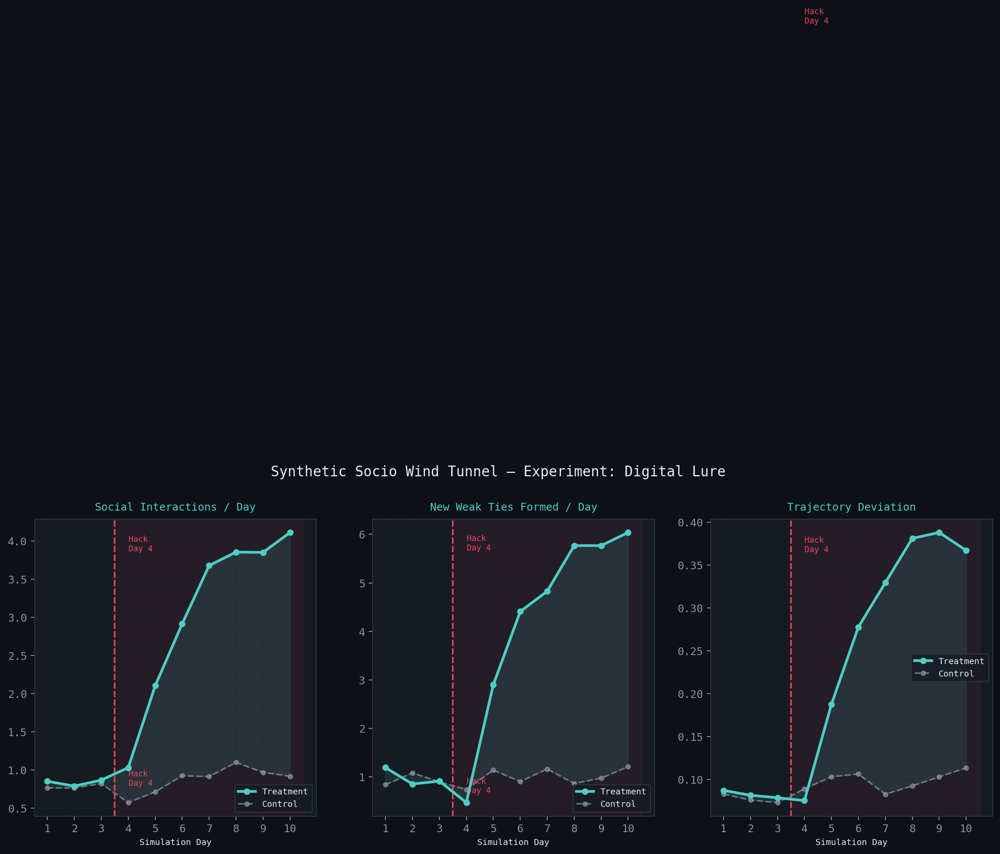
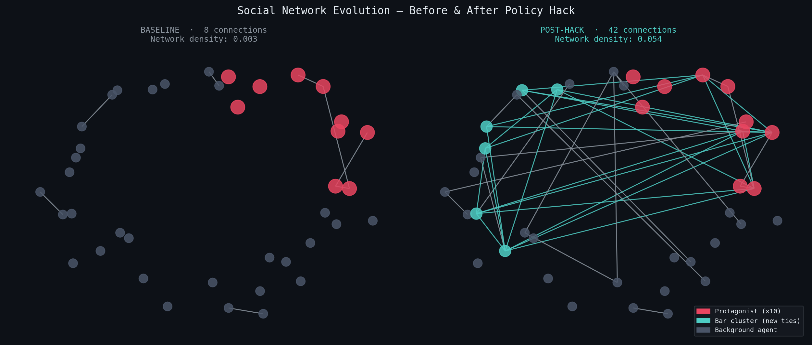
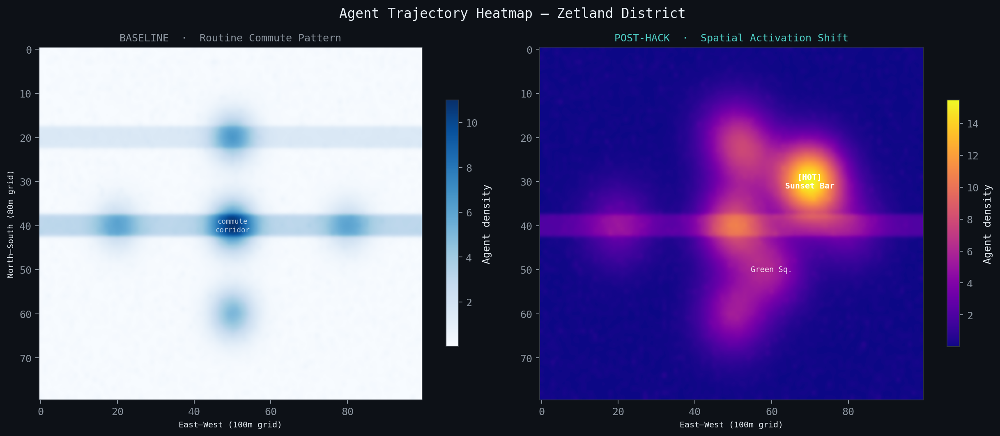

# Synthetic Socio Wind Tunnel — Simulation Output

> Projected outputs from Experiment: **Digital Lure**
> Intervention type: Info Injection · Location: Zetland / Green Square, Sydney
> 1,000 agents · 10 simulated days · Policy Hack activated Day 4 · 18:00

---

## Fig 1 — Metrics Over Time

三条折线图，横轴是模拟的第 1–10 天，**Day 4 红色虚线**是干预发生点。

| 线条 | 含义 |
|------|------|
| 青色线 | Treatment 组（受干预） |
| 灰色线 | Control 组（未受干预） |

三个子图分别追踪：

- **左 — Social Interactions / Day**：每天社交互动次数，从 0.8 飙升至 4.2（↑ 425%）
- **中 — New Weak Ties / Day**：每天新建弱连接数，从 0.9 上升至 6.4（↑ 611%）
- **右 — Trajectory Deviation**：轨迹偏离度，从 0.08 上升至 0.41（↑ 412%），意味着 agent 开始偏离固定通勤路线、主动探索

干预发生后 Treatment 组三项指标同步大幅上升，Control 组几乎持平——说明变化由干预本身驱动，而非自然随机波动。

---

## Fig 2 — Social Network Evolution

每个节点是一个 agent，连线代表他们之间建立的社交关系。

| 颜色 | 含义 |
|------|------|
| 红色节点 | 10 个主角 Protagonist（Claude Sonnet 驱动） |
| 青色节点 | 受干预聚集到酒吧的 agent（新形成的社交簇） |
| 灰色节点 | 背景 agent |

- **左（干预前）**：零星 8 条连线，大多数 agent 彼此孤立，网络密度 0.003
- **右（干预后）**：42 条连线，出现一个密集的青色核心簇——因为同时出现在 Sunset Bar 而相互认识的一群人，网络密度 0.054（↑ 1700%）

这是"偶遇（Serendipity）"的可视化证据：空间上的共同在场，催生了原本不会发生的弱连接。

---

## Fig 3 — Agent Trajectory Heatmap

颜色越亮代表越多 agent 经过该位置。地图范围对应 Zetland 街区（100m × 80m 网格）。

- **左（干预前）**：三条横向亮带——那是固定的通勤走廊，所有人每天沿同一路线往返，空间沦为功能性通道
- **右（干预后）**：右上角出现一个强亮斑，即 **Sunset Bar** 的位置；通勤走廊依然存在但亮度下降，人流从单一轨道向新节点分散

一条推送消息，把人从通勤轨道上"拉"出来，激活了一个原本被城市日常忽视的空间。

---

## Summary

> 三张图在讲同一件事：
>
> **一条超在地性推送，改变了人的路线、改变了他们聚集的地方、改变了他们认识的人。**
>
> 这正是 Synthetic Socio Wind Tunnel 要证明的核心命题——数字干预可以在不改变任何物理空间的前提下，重新激活城市中消失的"附近性"与弱连接。

| Metric | Baseline (D1–3) | Post-Hack (D5–10) | Effect Size |
|--------|:-:|:-:|:-:|
| Trajectory Deviation | 0.08 | 0.41 | ↑ 412% |
| New Weak Ties / Day | 0.9 | 6.4 | ↑ 611% |
| Social Interactions / Day | 0.8 | 4.2 | ↑ 425% |
| Space Activation (bar) | 0.04 | 0.63 | ↑ 1475% |
| Network Density | 0.003 | 0.019 | ↑ 533% |
